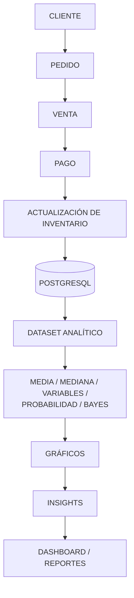
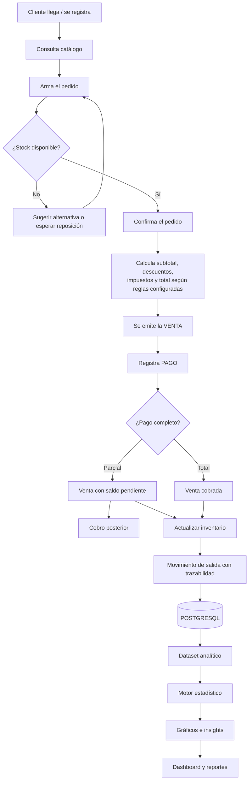
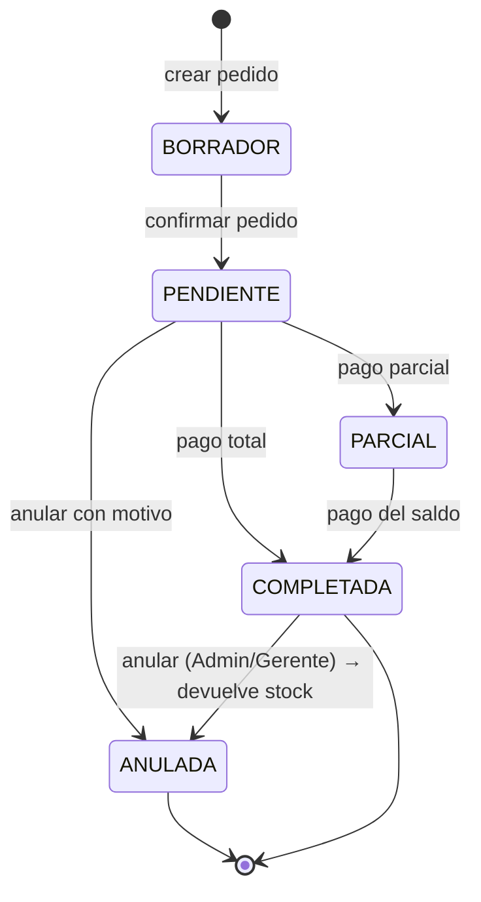
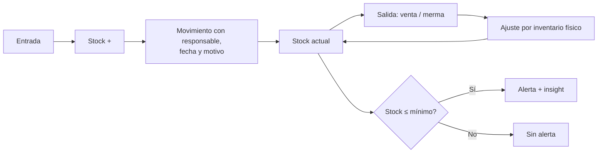
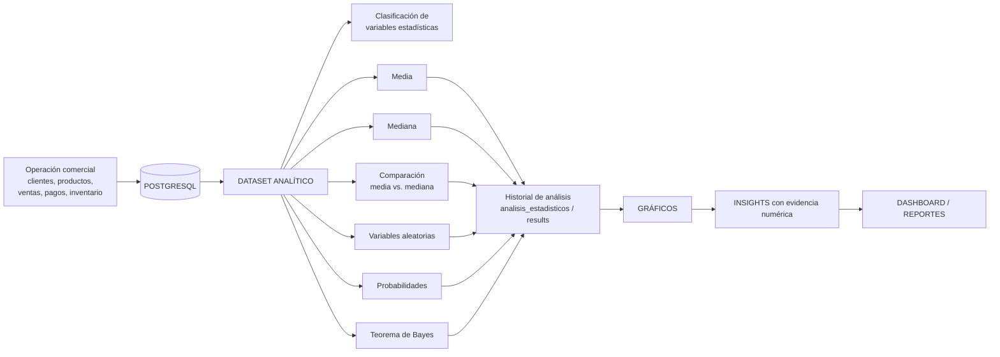

# SalesIA Enterprise — Documento de Requisitos

> **Fuente normativa:** *SalesIA Enterprise — Plan Integral de Desarrollo, Versión 1.0*.
> Este documento desarrolla el entregable de la **FASE 01 – Análisis y levantamiento**:
> *"Requisitos, alcance, actores, reglas de negocio y casos de uso."*

| Campo | Valor |
|---|---|
| **Documento** | Requisitos y casos de uso — SalesIA Enterprise |
| **Fase** | FASE 01 — Análisis y levantamiento |
| **Versión** | 1.1 (revisada contra el Plan Integral v1.0) |
| **Documento fuente** | Plan Integral de Desarrollo – SalesIA Enterprise v1.0 |
| **Base académica** | Semana 07 — Estadística aplicada (*Fundamentos y Algoritmia para Inteligencia Artificial*) |
| **Arquitectura** | React + TypeScript · Python/FastAPI · PostgreSQL |
| **Estado** | En revisión |
| **Equipo** | Grupo 4 — SENATI |
| **Fecha** | 01 de octubre de 2026 |

---

## 0. Relación con el documento fuente y base académica

| Contenido Semana 07 | Aplicación en SalesIA |
|---|---|
| Estadística aplicada en IA | Módulo Analytics y motor de análisis comercial |
| Variables estadísticas | Variables de ventas, clientes, productos e inventario |
| Media aritmética | Ticket promedio, venta promedio y métricas por producto/vendedor |
| Mediana | Venta central y análisis de concentración de valores |
| Python para cálculos | Backend / motor estadístico con Python |
| Teorema de Bayes | Análisis de probabilidades comerciales |
| Variables aleatorias | Cantidades de productos, montos de venta y variables cuantitativas |

**Principio rector del proyecto:**

> La arquitectura está planteada para que **las ventas generen los datos** y el módulo Analytics los convierta en
> estadísticas, gráficos e insights, **en lugar de crear una calculadora estadística independiente**.

**Evolución a Semana 08 (fuera del alcance de esta fase):** varianza, desviación estándar, distribuciones y
probabilidades, hipótesis estadística, p-valor y esperanza matemática.

---

## 1. Problema

Las empresas necesitan registrar sus operaciones comerciales y convertir los datos de ventas en información útil
para el análisis. **Un sistema que solo registra ventas no aprovecha completamente los datos generados.**

Problemas concretos detectados en el levantamiento:

- **Registro sin analítica:** los sistemas tradicionales guardan ventas, pero no responden *qué* significa lo vendido.
- **Datos dispersos:** clientes, ventas, pagos e inventario viven en hojas de cálculo aisladas e incompatibles entre sí.
- **Decisiones por intuición:** no hay evidencia numérica para decidir qué stock reponer, qué producto impulsar o a qué cliente fidelizar.
- **Sin trazabilidad:** no se quién anuló una venta, quién ajustó el stock ni cuándo.
- **Contenido acadérico sin aplicación:** la estadística de la Semana 07 se estudia en Python aislado, sin integrarse en un sistema real.

**Problema central:**

> SalesIA propone **integrar gestión operativa y analítica dentro de una misma plataforma**: la operación comercial
> genera los datos en PostgreSQL, Python los analiza y React los presenta como indicadores, gráficos e insights
> accionables.

---

## 2. Objetivos

### 2.1 Objetivo general

> Diseñar y desarrollar un sistema web empresarial de gestión de ventas con arquitectura escalable, capaz de
> registrar operaciones comerciales y aplicar análisis estadístico sobre los datos mediante React, Python y PostgreSQL.

### 2.2 Objetivos específicos

| # | Objetivo específico | RF asociado |
|---|---|---|
| OE-01 | Gestionar clientes, productos, vendedores, ventas, pedidos y pagos. | RF-03, RF-04, RF-05, RF-06, RF-07 |
| OE-02 | Centralizar la información comercial en PostgreSQL. | RNF-03 |
| OE-03 | Implementar una API empresarial con Python/FastAPI. | RNF-05, RNF-08 |
| OE-04 | Construir una interfaz web modular con React y TypeScript. | RNF-01, RNF-06 |
| OE-05 | Aplicar media, mediana, variables estadísticas, probabilidades y Teorema de Bayes. | RF-11 a RF-17 |
| OE-06 | Visualizar resultados mediante gráficos estadísticos. | RF-18 |
| OE-07 | Construir una página Analytics con KPIs e insights. | RF-09, RF-19 |
| OE-08 | Generar reportes y conservar el historial de análisis. | RF-20, RF-21 |
| OE-09 | Implementar seguridad, auditoría, validaciones y pruebas. | RF-22, RNF-02, RNF-09 |

---

## 3. Alcance

### 3.1 Alcance por área

| Área | Alcance inicial |
|---|---|
| **Ventas** | Registro, consulta, detalle, estados y seguimiento |
| **Clientes** | Ficha, historial y comportamiento comercial |
| **Productos** | Catálogo, categorías, precios y estado |
| **Inventario** | Stock y movimientos |
| **Vendedores** | Gestión y métricas comerciales |
| **Analytics** | KPIs, gráficos, media, mediana y análisis estadístico |
| **Probabilidad** | Módulo de probabilidad y Bayes |
| **Insights** | Reglas analíticas basadas en resultados |
| **Reportes** | Reportes estadísticos y comerciales |
| **Seguridad** | Roles, permisos, autenticación y auditoría |

### 3.2 Fuera del alcance (Out-of-Scope) en FASE 01

- Pasarela de pagos en línea (el pago se registra manualmente).
- Facturación electrónica / emisión de comprobantes.
- Compras y órdenes de compra a proveedores.
- Planilla y recursos humanos (solo `empleados` como dato base).
- App móvil nativa, multi-idioma y multi-moneda.
- Integración con marketplaces.
- Contenido de Semana 08: hipótesis, p-valor, modelos predictivos (etapa posterior).

### 3.3 Supuestos

1. Existe histórico de ventas cargable para que el Analytics tenga material de análisis.
2. Se crea un usuario administrador inicial en la instalación.
3. Despliegue de instancia única, sin alta disponibilidad requerida en v1.
4. Montos en soles (PEN); IGV y descuentos son parámetros configurables.

### 3.4 Restricciones

- Interfaz 100% en español.
- Navegadores actuales (Chrome, Edge, Firefox — últimas 2 versiones), escritorio y tablet.
- Configuración por variables de entorno (RNF-10).
- El desarrollo avanza **fase por fase**: cada fase cierra con sus entregables, criterios de aceptación y evidencias antes de pasar a la siguiente.

---

## 4. Actores y roles

| Rol | Responsabilidades | Perfil |
|---|---|---|
| **Administrador** | Configura el sistema, usuarios, roles y parámetros. | Dueño / responsable técnico |
| **Gerente** | Consulta indicadores, Analytics, reportes y resultados comerciales. | Gerencia / dirección |
| **Vendedor** | Registra clientes, pedidos y ventas autorizadas. | Atención al mostrador |
| **Analista** | Ejecuta análisis estadísticos y genera insights/reportes. | Analítica / datos |
| **Almacén** | Gestiona stock y movimientos de inventario. | Encargado de almacén |

### 4.1 Matriz de permisos

| Recurso / Acción | Administrador | Gerente | Vendedor | Analista | Almacén |
|---|:---:|:---:|:---:|:---:|:---:|
| Usuarios, roles y parámetros | CRUD | — | — | — | — |
| Clientes | CRUD | CRUD | CRU | R | — |
| Productos y categorías | CRUD | CRUD | R | R | R |
| Vendedores / empleados | CRUD | R | — | R | — |
| Ventas y pedidos | CRUD | CRUD | CRU | R | R |
| Anular venta | CRUD | U | — | — | — |
| Pagos | CRUD | CRUD | CR | — | — |
| Inventario y movimientos | CRUD | R | R | R | CRUD |
| Datasets analíticos | CRUD | CRUD | R | CRUD | R |
| Estadística / probabilidad / Bayes | R | R | R | CRUD | R |
| Insights y reportes | CRUD | CRUD | R | CRUD | R |
| Auditoría | R | R | — | — | — |

> **R** = Read · **C** = Create · **U** = Update · **D** = Delete

---

## 5. Procesos del negocio

### 5.1 Flujo empresarial de ventas (cadena oficial del plan)



### 5.2 Detalle operativo del flujo



### 5.3 Descripción paso a paso

| # | Paso | Actor | Entrada | Salida / Efecto | Regla clave |
|---|---|---|---|---|---|
| 1 | Registro de cliente | Vendedor | DNI/RUC, nombre, contacto, dirección | Cliente creado | Documento único |
| 2 | Selección de productos | Vendedor | Búsqueda por SKU/categoría | Líneas del carrito | Solo productos `ACTIVO` |
| 3 | Creación del pedido | Vendedor | Carrito + cliente + fecha | Pedido `PENDIENTE` | No exceder stock |
| 4 | Cálculo de totales | Sistema | Subtotal por línea | Subtotal, descuento, impuesto, total | Recálculo en servidor |
| 5 | Emisión de venta | Vendedor | Pedido confirmado | `sale` numerada | Numeración correlativa inmutable |
| 6 | Registro de pago | Vendedor / Caja | Monto y medio de pago | `payment` vinculado | `PENDIENTE` / `PARCIAL` / `PAGADO` |
| 7 | Actualización de inventario | Sistema | Detalle de la venta | `movimientos_inventario` = `SALIDA` | Stock nunca negativo |
| 8 | Dataset analítico | Sistema | Datos en PostgreSQL | Dataset analítico | Base de todo el motor |
| 9 | Cálculo estadístico | Analista / Gerente | Dataset + métrica | Media, mediana, variables, probabilidad, Bayes | Se registra cada análisis y resultado (RF-21) |
| 10 | Gráficos, insights y reportes | Sistema / Analista | Resultados | KPIs, insights explicables, reportes | Cada insight muestra su evidencia numérica |

### 5.4 Diagrama de estados de la venta



### 5.5 Proceso de inventario



**Tipos de movimiento de inventario:**

| Tipo | Signo | Origen | Responsable |
|---|---|---|---|
| `ENTRADA` | + | Compra / recepción | Almacén |
| `SALIDA` | − | Venta confirmada | Sistema (automático) |
| `DEVOLUCION` | + | Devolución de cliente | Vendedor |
| `MERMA` | − | Daño, vencimiento, robo | Almacén |
| `AJUSTE` | ± | Inventario físico | Administrador / Gerente |

### 5.6 Proceso de análisis (motor estadístico)



---

## 6. Datos necesarios para Analytics

### 6.1 Modelo de datos (21 entidades del plan ↔ archivos del repositorio)

| Entidad | Propósito | Archivo en `backend/app/models/` |
|---|---|---|
| `usuarios` | Usuarios del sistema | `user.py` |
| `roles` | Roles y permisos | `role.py` |
| `empresas` | Empresa propietaria de los datos | `company.py` |
| `clientes` | Clientes | `customer.py` |
| `productos` | Productos | `product.py` |
| `categorias` | Categorías | `category.py` |
| `ventas` | Cabecera de venta | `sale.py` |
| `detalle_ventas` | Detalle de productos vendidos | `sale_detail.py` |
| `pagos` | Pagos | `payment.py` |
| `inventario` | Existencias | `inventory.py` |
| `movimientos_inventario` | Entradas y salidas | `inventory_movement.py` |
| `empleados` | Personal / vendedores | `employee.py` |
| `conjuntos_datos` | Conjuntos de datos para análisis | `dataset.py` |
| `variables_conjunto` | Variables estadísticas | `dataset_variable.py` |
| `observaciones` | Observaciones/datos analizados | `observation.py` |
| `analisis_estadisticos` | Historial de análisis | `statistical_analysis.py` |
| `resultados_estadisticos` | Resultados calculados | `statistical_result.py` |
| `analisis_bayes` | Resultados de Bayes | `bayes_analysis.py` |
| `variables_aleatorias` | Configuraciones de variables aleatorias | `random_variable.py` |
| `hallazgos` | Conclusiones generadas por reglas | `insight.py` |
| `reportes` | Reportes | `report.py` |
| `registros_auditoria` | Auditoría | `audit_log.py` |

**Relaciones principales:**

```
empresas
 ├── usuarios
 ├── clientes
 ├── productos ── categorias
 ├── empleados
 └── ventas ── detalle_ventas ── productos
              │
              └── pagos

ventas / clientes / productos
        │
        ▼
     conjuntos_datos
        │
        ▼
  variables_conjunto
        │
        ▼
   observaciones
        │
        ▼
 analisis_estadisticos
        ├── resultados_estadisticos
        ├── analisis_bayes
        └── hallazgos
```

### 6.2 Fuentes y variables

| Fuente | Campos clave aportados |
|---|---|
| `ventas` / `detalle_ventas` | fecha, total, cantidad, precio, descuento, estado, **vendedor** |
| `pagos` | monto, método de pago, fecha, estado |
| `inventario` / `movimientos_inventario` | stock, costo, tipo de movimiento, fecha |
| `clientes` | fecha de alta, segmento, antigüedad, frecuencia |
| `productos` / `categorias` | precio, costo, categoría, SKU |
| `empleados` | vendedor, métricas comerciales |
| `conjuntos_datos` / `variables_conjunto` / `observaciones` | datos cargados para análisis libre |

**Variables cuantitativas continuas:** `monto_venta`, `ticket_promedio`, `margen_unitario`, `tiempo_entrega`, `dias_entre_compras`.

**Variables cuantitativas discretas:** `cantidad_unidades`, `numero_lineas`, `stock_actual`, `numero_ventas_dia`, `numero_clientes_mes`.

**Variables cualitativas:** `categoria_producto`, `medio_pago`, `estado_venta`, `segmento_cliente`, `ciudad`, `rol_usuario`, `vendedor`.

**Clasificación de variables estadísticas (RF-14):** toda variable cargada debe declarar si es
**cualitativa** (nominal/ordinal) o **cuantitativa** (discreta/continua) antes de ser analizada.

### 6.3 Indicadores (KPIs) del Dashboard Analytics

| # | Panel | Indicadores |
|---|---|---|
| KPI-01 | **Resumen** | Ventas, ingresos, transacciones, clientes |
| KPI-02 | **Ventas** | Ventas por día/mes, ticket promedio, **media y mediana** |
| KPI-03 | **Productos** | Cantidad vendida, ingresos, participación |
| KPI-04 | **Clientes** | Compras, frecuencia, ticket |
| KPI-05 | **Vendedores** | Ventas, ingresos y promedio |
| KPI-06 | **Variables** | Tipo, distribución y estadísticas |
| KPI-07 | **Probabilidad** | Eventos, probabilidades y Bayes |
| KPI-08 | **Insights** | Observaciones generadas a partir de resultados |

**Filtros requeridos:** periodo, sucursal, vendedor y categoría.

**Métricas derivadas de control:**

| ID | Métrica | Fórmula |
|---|---|---|
| KPI-09 | Rotación de inventario | Costo de ventas / Stock promedio |
| KPI-10 | Productos con stock bajo | COUNT(`stock ≤ mínimo`) |
| KPI-11 | Tasa de anulación | Anuladas / Totales × 100 |
| KPI-12 | Recompra | Clientes con ≥ 2 compras / Total clientes × 100 |

### 6.4 Motor estadístico requerido (Semana 07)

| Análisis | Módulo del repositorio | Fórmula / Regla | RF |
|---|---|---|---|
| Media aritmética | `analytics/mean` | media = (x₁ + x₂ + … + xₙ) / n | RF-11 |
| Mediana | `analytics/median` | Ordenar y tomar el valor central; con *n* par, promedio de los dos centrales | RF-12 |
| Comparación media vs. mediana | `analytics/compare` | Diferencia absoluta y relativa, interpretación de sesgo | RF-13 |
| Variables estadísticas | `analytics/variables` | Clasificación y frecuencias | RF-14 |
| Variables aleatorias | `analytics/random_variables` | Definición, distribución y análisis | RF-15 |
| Probabilidades | `analytics/probability` | P(A), P(A∩B), P(A\|B) | RF-16 |
| Teorema de Bayes | `analytics/bayes` | P(A\|B) = P(B\|A) × P(A) / P(B) | RF-17 |
| Gráficos | frontend `analytics` | Visualización de resultados | RF-18 |
| Insights | `services/insight_service` | Reglas determinísticas con evidencia numérica | RF-19 |

> **Nota:** varianza, desviación estándar, esperanza matemática, hipótesis y p-valor corresponden a la
> **Semana 08** y están diferidos (§3.2).

### 6.5 Calidad del dato

- **Completitud:** ≥ 95% de campos obligatorios diligenciados.
- **Unicidad:** documento de identidad, SKU, número de venta y nombre de usuario únicos.
- **Validez:** fechas ISO-8601; montos ≥ 0 con 2 decimales.
- **Consistencia:** `stock = inicial + Σentradas − Σsalidas`.
- **Trazabilidad:** todo movimiento registra usuario, fecha y motivo.
- **No destructividad:** las ventas no se borran; se anulan (soft delete) y quedan en auditoría.

---

## 7. Requerimientos funcionales

| ID | Requerimiento | Prioridad | Fase |
|---|---|---|---|
| RF-01 | Autenticación y control de acceso por roles | Alta | 05 / 13 |
| RF-02 | Gestión de usuarios | Alta | 05 / 13 |
| RF-03 | Gestión de clientes | Alta | 07 |
| RF-04 | Gestión de productos y categorías | Alta | 07 |
| RF-05 | Gestión de vendedores | Alta | 07 |
| RF-06 | Registro de ventas y detalle de venta | Alta | 08 |
| RF-07 | Gestión de pagos y métodos de pago | Alta | 08 |
| RF-08 | Gestión de inventario y movimientos | Alta | 08 |
| RF-09 | Dashboard ejecutivo | Alta | 10 |
| RF-10 | Gestión de datasets analíticos derivados de las operaciones | Alta | 09 |
| RF-11 | Cálculo de media | Alta | 09 |
| RF-12 | Cálculo de mediana | Alta | 09 |
| RF-13 | Comparación media vs. mediana | Alta | 09 |
| RF-14 | Análisis de variables estadísticas | Alta | 09 |
| RF-15 | Análisis de variables aleatorias | Media | 09 |
| RF-16 | Cálculo de probabilidades | Media | 09 |
| RF-17 | Análisis mediante Teorema de Bayes | Media | 09 |
| RF-18 | Visualización mediante gráficos | Media | 10 |
| RF-19 | Generación de insights basados en reglas | Media | 11 |
| RF-20 | Generación y consulta de reportes | Media | 12 |
| RF-21 | Historial de análisis | Media | 09 |
| RF-22 | Registro de auditoría | Alta | 13 |

### Requerimientos no funcionales

| ID | Requerimiento | Prioridad |
|---|---|---|
| RNF-01 | Arquitectura modular y mantenible | Alta |
| RNF-02 | Validación de datos en frontend y backend | Alta |
| RNF-03 | Integridad referencial en PostgreSQL | Alta |
| RNF-04 | Autenticación segura y autorización por rol | Alta |
| RNF-05 | API documentada | Media |
| RNF-06 | Diseño responsive para escritorio y tablet | Media |
| RNF-07 | Trazabilidad de operaciones críticas | Alta |
| RNF-08 | Separación de presentación, lógica de negocio y persistencia | Alta |
| RNF-09 | Pruebas unitarias, integración y aceptación | Alta |
| RNF-10 | Configuración por variables de entorno | Alta |
| RNF-11 | Manejo centralizado de errores | Media |
| RNF-12 | Rendimiento adecuado para consultas analíticas | Media |

---

## 8. Casos de uso

**Leyenda:** Actor principal · Precondición · Flujo básico · Postcondición.

### 8.1 Acceso y administración

| ID | Caso de uso | Actor | Precondición | Flujo básico | Postcondición |
|---|---|---|---|---|---|
| CU-01 | Iniciar sesión | Cualquier usuario | Usuario registrado y activo | 1. Credenciales → 2. Validación → 3. Sesión → 4. Redirección por rol | Sesión iniciada |
| CU-02 | Cerrar sesión | Usuario autenticado | Sesión activa | 1. Solicita salida → 2. Invalida token | Sesión terminada |
| CU-03 | Recuperar contraseña | Usuario con email válido | Email registrado | 1. Solicita → 2. Enlace → 3. Nueva clave | Clave actualizada |
| CU-04 | Gestionar usuarios | Administrador | Sesión Administrador | 1. Lista → 2. Crea/edita/activa → 3. Asigna rol | Usuario actualizado |
| CU-05 | Configurar parámetros | Administrador | Sesión Administrador | 1. Abre configuración → 2. Ajusta IGV, descuentos, series → 3. Guarda | Parámetros vigentes |

### 8.2 Comercial

| ID | Caso de uso | Actor | Precondición | Flujo básico | Postcondición |
|---|---|---|---|---|---|
| CU-06 | Registrar cliente | Vendedor | Sesión iniciada | 1. Formulario → 2. Datos → 3. Valida documento → 4. Guarda | Cliente creado |
| CU-07 | Editar cliente | Vendedor / Gerente | Cliente existente | 1. Busca → 2. Modifica → 3. Guarda | Cliente actualizado |
| CU-08 | Consultar historial del cliente | Vendedor / Gerente / Analista | Cliente con compras | 1. Selecciona cliente → 2. Lista compras, pagos y frecuencia | Historial visible |
| CU-09 | Buscar y filtrar clientes | Cualquier rol con acceso | Sesión iniciada | 1. Nombre/DNI/filtro → 2. Resultados | Cliente localizado |
| CU-10 | Crear producto | Administrador / Gerente | Sesión con permiso | 1. SKU, nombre, precio, costo, categoría, stock mínimo → 2. Guarda | Producto activo |
| CU-11 | Gestionar categorías | Administrador / Gerente | Sesión con permiso | 1. Lista → 2. Crea/edita → 3. Guarda | Categoría vigente |
| CU-12 | Gestionar vendedores | Administrador | Sesión Administrador | 1. CRUD de `empleados` → 2. Asigna a usuarios → 3. Guarda | Vendedor registrado (RF-05) |

### 8.3 Ventas, pagos e inventario

| ID | Caso de uso | Actor | Precondición | Flujo básico | Postcondición |
|---|---|---|---|---|---|
| CU-13 | Registrar pedido | Vendedor | Cliente y productos existentes | 1. Cliente → 2. Líneas → 3. Valida stock → 4. Confirma | Pedido confirmado |
| CU-14 | Registrar venta | Vendedor | Pedido confirmado | 1. Valida stock → 2. Calcula subtotal, descuentos, impuestos y total → 3. Emite numerada | Venta COMPLETADA |
| CU-15 | Anular pedido | Vendedor / Administrador | Pedido en borrador o pendiente | 1. Selecciona → 2. Motivo → 3. Confirma | Pedido anulado |
| CU-16 | Anular venta | Administrador / Gerente | Venta no anulada | 1. Selecciona → 2. Motivo → 3. Confirma → 4. Devuelve stock | Venta ANULADA + stock repuesto |
| CU-17 | Registrar pago | Vendedor / Administrador | Venta existente | 1. Venta → 2. Monto y método → 3. Guarda | Pago registrado, estado actualizado |
| CU-18 | Consultar historial de ventas | Vendedor / Gerente / Analista | Sesión iniciada | 1. Filtros de fecha/estado/vendedor → 2. Lista | Historial visible |
| CU-19 | Consultar stock | Almacén / Gerente | Sesión iniciada | 1. Filtro categoría/estado → 2. Lista | Inventario visible |
| CU-20 | Registrar entrada de inventario | Almacén | Producto existente | 1. Producto → 2. Cantidad y motivo → 3. Confirma | Stock incrementado |
| CU-21 | Registrar salida manual | Almacén | Stock suficiente | 1. Producto → 2. Cantidad → 3. Motivo → 4. Confirma | Stock descontado |
| CU-22 | Registrar merma | Almacén / Administrador | Producto existente | 1. Producto → 2. Cantidad → 3. Motivo obligatorio | Stock descontado + auditado |
| CU-23 | Ajuste por inventario físico | Administrador / Gerente | Conteo realizado | 1. Cantidad real → 2. Diferencia calculada → 3. Confirma | Stock igualado |
| CU-24 | Alerta de stock mínimo | Sistema | Stock ≤ mínimo | 1. Detecta umbral → 2. Genera alerta e insight | Alerta en dashboard |

### 8.4 Analytics, insights y reportes

| ID | Caso de uso | Actor | Precondición | Flujo básico | Postcondición |
|---|---|---|---|---|---|
| CU-25 | Crear dataset analítico | Analista / Gerente | Datos en PostgreSQL | 1. Elige fuente y periodo → 2. Mapea variables → 3. Declara tipos → 4. Crea | Dataset disponible (RF-10) |
| CU-26 | Calcular media | Analista / Gerente | Dataset con ≥ 2 observaciones | 1. Dataset → 2. Variable → 3. Calcula → 4. Registra en historial | Media mostrada y almacenada (RF-11, RF-21) |
| CU-27 | Calcular mediana | Analista / Gerente | Dataset con ≥ 2 observaciones | 1. Dataset → 2. Variable → 3. Ordena y calcula → 4. Registra | Mediana mostrada y almacenada (RF-12) |
| CU-28 | Comparar media vs. mediana | Analista / Gerente | Ambos valores calculados | 1. Selecciona → 2. Compara → 3. Interpreta sesgo | Comparativa (RF-13) |
| CU-29 | Analizar variables estadísticas | Analista | Dataset declarado | 1. Clasifica → 2. Frecuencias → 3. Resumen | Variables analizadas (RF-14) |
| CU-30 | Analizar variable aleatoria | Analista | Variable definida | 1. Definición → 2. Parámetros → 3. Análisis | Variable analizada (RF-15) |
| CU-31 | Calcular probabilidades | Analista / Gerente | Eventos definidos | 1. Eventos → 2. Calcula P(A), P(A\|B) → 3. Muestra | Probabilidad mostrada (RF-16) |
| CU-32 | Análisis Bayesiano | Analista / Gerente | P(A), P(B\|A), P(B) ingresados | 1. Datos → 2. Aplica fórmula → 3. Muestra resultado explicable | Posterior calculado y reproducible (RF-17) |
| CU-33 | Visualizar gráficos | Todos según rol | Resultados existentes | 1. Abre Analytics → 2. Selecciona gráfico → 3. Filtros | Gráfico renderizado (RF-18) |
| CU-34 | Generar insight | Analista / Sistema | Resultado de análisis | 1. Aplica regla → 2. Genera observación → 3. Adjunta evidencia numérica | Insight con evidencia (RF-19) |
| CU-35 | Generar reporte | Analista / Gerente | Datos disponibles | 1. Tipo y periodo → 2. Genera → 3. Exporta / imprime | Reporte descargable (RF-20) |
| CU-36 | Consultar historial de análisis | Analista / Gerente | Análisis previos | 1. Filtra por tipo/fecha → 2. Lista resultados anteriores | Historial consultable (RF-21) |
| CU-37 | Ver dashboard | Todos según rol | Sesión iniciada | 1. Ingresa → 2. Carga KPIs y filtros | KPIs y tendencias visibles (RF-09) |

### 8.5 Auditoría

| ID | Caso de uso | Actor | Precondición | Flujo básico | Postcondición |
|---|---|---|---|---|---|
| CU-38 | Consultar bitácora | Administrador | Sesión Administrador | 1. Filtra fecha/usuario/acción → 2. Lista eventos | Auditoría visible (RF-22) |

**Total: 38 casos de uso.**

---

## 9. Reglas de negocio

### 9.1 Clientes, productos y vendedores

| ID | Regla |
|---|---|
| RN-01 | El documento de identidad (DNI/RUC) del cliente es **único** en el sistema. |
| RN-02 | Un cliente con ventas pendientes **no se elimina**; se desactiva. |
| RN-03 | El SKU del producto es único y puede auto-generarse. |
| RN-04 | Solo es vendible un producto con `estado = ACTIVO` y `stock > 0`. |
| RN-05 | `precio_venta ≥ precio_costo`; vender a costo requiere aprobación de Administrador. |
| RN-06 | Cada producto pertenece a **una y solo una** categoría. |
| RN-07 | Un vendedor (`empleados`) debe estar activo para operar ventas. |
| RN-08 | Las métricas de vendedor se calculan solo sobre ventas no anuladas. |

### 9.2 Ventas y pagos

| ID | Regla |
|---|---|
| RN-10 | La cantidad solicitada **nunca** supera el stock disponible. |
| RN-11 | Subtotal, descuentos, impuestos y total se calculan **siempre en el servidor** según parámetros configurados. |
| RN-12 | El número de venta es correlativo, único e **inmutable**. |
| RN-13 | Un descuento por línea no supera el 100% de su subtotal. |
| RN-14 | Solo Administrador y Gerente anulan ventas cobradas. |
| RN-15 | Anular una venta devuelve **exactamente** las unidades al inventario. |
| RN-16 | Un pago no excede el saldo pendiente de la venta. |
| RN-17 | La venta queda `PAGADO` solo cuando `Σ pagos = total`. |
| RN-18 | Toda anulación exige un motivo de al menos 10 caracteres. |
| RN-19 | No se registran ventas con fecha futura. |

### 9.3 Inventario

| ID | Regla |
|---|---|
| RN-20 | El stock **nunca** queda negativo; si no alcanza, la operación se rechaza. |
| RN-21 | Cada movimiento registra responsable, fecha y motivo. |
| RN-22 | Mermas y ajustes solo los realiza Administrador, Gerente o Almacén. |
| RN-23 | Se cumple siempre: `stock_inicial + Σentradas − Σsalidas = stock_actual`. |
| RN-24 | Al alcanzar `stock ≤ stock_minimo` se genera alerta e insight automáticamente. |

### 9.4 Seguridad y auditoría

| ID | Regla |
|---|---|
| RN-30 | Las contraseñas se almacenan con hash (bcrypt/argon2), nunca en texto plano. |
| RN-31 | Tras 5 intentos fallidos la cuenta se bloquea 15 minutos. |
| RN-32 | Los tokens expiran en 8 horas y no son reutilizables. |
| RN-33 | Un usuario no modifica su propio rol ni eleva sus permisos. |
| RN-34 | Toda escritura sobre datos sensibles genera registro en `registros_auditoria` (RF-22). |
| RN-35 | Un usuario desactivado pierde el acceso de inmediato. |
| RN-36 | Los secretos se gestionan por variables de entorno, nunca en el código (RNF-10). |

### 9.5 Motor estadístico e insights

| ID | Regla |
|---|---|
| RN-40 | Todo cálculo exige **≥ 2 observaciones**; si no, responde "datos insuficientes" (nunca `NaN`). |
| RN-41 | La mediana y los percentiles se calculan sobre datos **ordenados**; con *n* par se promedian los dos centrales. |
| RN-42 | Al mostrar la media se muestra también la mediana para permitir la comparación (RF-13). |
| RN-43 | Bayes exige `P(B) > 0`; caso contrario responde error con mensaje en español. |
| RN-44 | Las ventas `ANULADA` **se excluyen** de todo cálculo estadístico por defecto. |
| RN-45 | Todo resultado registra **historial** con dataset, variable, valor, fecha y usuario (RF-21). |
| RN-46 | Un dataset debe declarar el tipo de cada variable (cualitativa/cuantitativa) antes de analizarse (RF-14). |
| RN-47 | Cada insight debe **mostrar el resultado estadístico que lo origina** con su evidencia numérica (RF-19). |
| RN-48 | Los insights se generan con reglas **determinísticas**: mismos datos ⇒ mismo insight. |
| RN-49 | Todo cálculo estadístico es **reproducible**: mismos datos de entrada ⇒ idéntico resultado. |

**Total: 40 reglas de negocio.**

---

## 10. Criterios de aceptación

### 10.1 Criterios maestros del Plan Integral (v1.0)

| # | Criterio | Verificación |
|---|---|---|
| CA-M01 | Un usuario autorizado puede iniciar sesión y acceder únicamente a sus módulos. | Prueba de roles |
| CA-M02 | Una venta puede registrarse con sus detalles y actualizar el inventario. | Flujo de venta |
| CA-M03 | Los datos de ventas pueden consultarse desde Analytics. | Consulta cruzada |
| CA-M04 | El sistema calcula correctamente media y mediana. | Pruebas unitarias |
| CA-M05 | El sistema permite identificar variables estadísticas. | Análisis de variables |
| CA-M06 | El sistema puede analizar variables aleatorias definidas. | Módulo VA |
| CA-M07 | El módulo de Bayes devuelve un resultado reproducible con los datos introducidos. | Prueba de Bayes |
| CA-M08 | Los resultados aparecen en gráficos y KPIs. | Revisión visual |
| CA-M09 | Los insights muestran el resultado que los origina. | Revisión de evidencia |
| CA-M10 | Los análisis quedan almacenados y pueden consultarse posteriormente. | Historial |
| CA-M11 | Las operaciones críticas quedan registradas en auditoría. | Bitácora |
| CA-M12 | El sistema supera las pruebas definidas antes del despliegue. | Reporte de pruebas |

### 10.2 Criterios de la FASE 01

| ID | Criterio | Verificación |
|---|---|---|
| CA-01 | Documento de requisitos aprobado por el Product Owner. | Acta §13 |
| CA-02 | Alcance y fuera de alcance definidos y firmados. | §3 |
| CA-03 | Actores y roles identificados con matriz de permisos. | §4 |
| CA-04 | Proceso `cliente → pedido → venta → pago → inventario` documentado con diagrama. | §5 |
| CA-05 | Datos para Analytics identificados con su fuente y tipo de variable. | §6 |
| CA-06 | Casos de uso cubren los 6 RF comerciales (RF-03 a RF-08) y los 8 RF del motor analítico (RF-10 a RF-17). | §7, §8 |
| CA-07 | Reglas de negocio cubren ventas, inventario, seguridad y motor estadístico. | §9 |
| CA-08 | Criterios de aceptación verificables y trazables a RF. | §10 |

### 10.3 Criterios funcionales detallados (formato Dado/Cuando/Entonces)

| ID | Criterio | Dado / Cuando / Entonces |
|---|---|---|
| CA-10 | Dato duplicado | **Dado** un DNI duplicado **Cuando** se guarda **Entonces** responde `409` y no crea el registro. |
| CA-11 | Stock insuficiente | **Dado** stock 3 **Cuando** se piden 5 **Entonces** se rechaza y el stock no cambia. |
| CA-12 | Cálculo de totales | **Dado** 2 ítems con descuento **Cuando** se emite la venta **Entonces** `total = Σ(precio×cantidad) − descuento + impuesto` con 2 decimales exactos. |
| CA-13 | Numeración | **Dado** la venta N.º 100 **Cuando** se emite otra **Entonces** recibe N.º 101, sin repetir ni saltar. |
| CA-14 | Pago parcial | **Dado** una venta de S/ 200 **Cuando** se paga S/ 100 **Entonces** el estado es `PARCIAL` y el saldo S/ 100. |
| CA-15 | Anulación con devolución | **Dado** una venta de 4 unidades **Cuando** se anula **Entonces** el stock sube 4 y queda registro de auditoría. |
| CA-16 | Stock no negativo | **Dado** stock 0 **Cuando** se intenta una salida **Entonces** responde `400` con "stock insuficiente". |
| CA-17 | Alerta de stock | **Dado** `stock_minimo = 10` **Cuando** el stock llega a 10 **Entonces** aparece la alerta en el dashboard. |
| CA-18 | Exclusión de anuladas | **Dado** ventas completadas y anuladas **Cuando** se calcula el ticket promedio **Entonces** las anuladas no entran. |

### 10.4 Criterios analíticos

| ID | Criterio | Dado / Cuando / Entonces |
|---|---|---|
| CA-20 | Media | **Dado** `{10, 20, 30, 40}` **Cuando** se calcula la media **Entonces** devuelve `25.0`. |
| CA-21 | Mediana par | **Dado** `{10, 20, 30, 40}` **Cuando** se calcula la mediana **Entonces** devuelve `25.0`. |
| CA-22 | Mediana impar | **Dado** `{7, 3, 9}` **Cuando** se calcula la mediana **Entonces** devuelve `7`. |
| CA-23 | Datos insuficientes | **Dado** 1 observación **Cuando** se pide cualquier métrica **Entonces** responde "datos insuficientes". |
| CA-24 | Probabilidad condicional | **Dado** `P(A∩B)=0.12` y `P(B)=0.4` **Cuando** se calcula `P(A\|B)` **Entonces** devuelve `0.3`. |
| CA-25 | Bayes válido | **Dado** `P(A)=0.3`, `P(B\|A)=0.8`, `P(B)=0.5` **Cuando** se aplica Bayes **Entonces** `P(A\|B) = 0.48`. |
| CA-26 | Bayes inválido | **Dado** `P(B)=0` **Cuando** se aplica Bayes **Entonces** responde `422` con mensaje en español. |
| CA-27 | Comparación | **Dado** dos meses **Cuando** se comparan **Entonces** muestra diferencia absoluta y porcentual. |
| CA-28 | Historial | **Dado** un análisis ejecutado **Cuando** se consulta el historial **Entonces** aparece con dataset, fecha y usuario. |
| CA-29 | Insight con evidencia | **Dado** un insight generado **Cuando** se abre **Entonces** muestra el resultado estadístico que lo origina. |
| CA-30 | Reproducibilidad | **Dado** los mismos datos **Cuando** se repite el cálculo **Entonces** el resultado es idéntico. |

### 10.5 Criterios no funcionales

| ID | Criterio | Meta |
|---|---|---|
| CA-40 | Rendimiento API (CRUD) | ≤ 500 ms (p95) |
| CA-41 | Consulta analítica sobre 100k registros | ≤ 3 s |
| CA-42 | Carga del dashboard | ≤ 2 s en red local |
| CA-43 | Compatibilidad | Últimas 2 versiones de Chrome, Edge y Firefox; escritorio y tablet |
| CA-44 | Responsive | Válido desde 360 px (RNF-06) |
| CA-45 | Idioma | 100% de la interfaz en español |
| CA-46 | Cobertura de pruebas | ≥ 80% (RNF-09) |
| CA-47 | Secretos | Ningún `.env` en el repositorio (RNF-10) |
| CA-48 | Errores | Formato único `{ codigo, mensaje, detalle }` (RNF-11) |

---

## 11. Contrato API inicial (referencia de la FASE 05)

| Método | Endpoint | Función |
|---|---|---|
| POST | `/auth/login` | Autenticación |
| GET | `/customers` | Listar clientes |
| POST | `/customers` | Crear cliente |
| GET | `/products` | Listar productos |
| POST | `/sales` | Registrar venta |
| GET | `/sales` | Consultar ventas |
| GET | `/dashboard/summary` | Resumen ejecutivo |
| POST | `/statistics/mean` | Calcular media |
| POST | `/statistics/median` | Calcular mediana |
| POST | `/statistics/compare` | Comparar media/mediana |
| POST | `/probability/bayes` | Calcular Bayes |
| POST | `/random-variables/analyze` | Analizar variable aleatoria |
| GET | `/insights` | Consultar insights |
| GET | `/reports` | Consultar reportes |

> El contrato completo (DTO/schemas, códigos de error, autenticación y autorización) se documenta en la
> **FASE 02 – Arquitectura técnica** y se implementa en la **FASE 05**.

---

## 12. Estrategia de pruebas

| Nivel | Ejemplos | Archivos previstos en el repo |
|---|---|---|
| Unitarias | Media, mediana, Bayes, validadores | `tests/unit/test_mean.py`, `test_median.py`, `test_bayes.py`, `test_probability.py` |
| Integración | Venta → inventario → persistencia | `tests/integration/test_sales_flow.py`, `test_inventory.py` |
| API | Status codes, schemas, permisos | `tests/api/test_auth.py`, `test_statistics.py` |
| Frontend | Formularios, rutas, filtros y estados | Por definir en FASE 06 / 14 |
| Datos | Constraints, duplicados y valores nulos | Por definir en FASE 04 |
| Aceptación | Flujo completo de venta y análisis | §10 |

---

## 13. Plan de fases (contexto)

| Fase | Nombre | Entregable principal |
|---|---|---|
| **01** | **Análisis y levantamiento** | **Documento de requisitos y casos de uso** ← *este documento* |
| 02 | Arquitectura técnica | Arquitectura, módulos, estructura de carpetas, contratos API y decisiones tecnológicas |
| 03 | UX/UI empresarial | Wireframes, navegación, diseño visual, componentes y dashboard |
| 04 | Base de datos PostgreSQL | Modelo ER, tablas, restricciones, índices, migraciones y datos semilla |
| 05 | Backend/API | FastAPI, autenticación, servicios, validaciones, endpoints y documentación |
| 06 | Frontend React | Layouts, rutas, componentes, formularios y consumo de API |
| 07 | Clientes y productos | Catálogos, fichas, búsqueda, filtros y relaciones comerciales |
| 08 | Ventas, pedidos e inventario | Flujo completo de venta, detalle, pagos, stock y trazabilidad |
| 09 | Motor estadístico – Semana 07 | Variables, media, mediana, variables aleatorias, probabilidad y Bayes |
| 10 | Dashboard Analytics | KPIs, gráficos, filtros, comparaciones y evolución temporal |
| 11 | Insights empresariales | Reglas estadísticas, detección de patrones y explicación de resultados |
| 12 | Reportes | Reportes comerciales/estadísticos, exportación y consultas históricas |
| 13 | Seguridad y auditoría | Roles, permisos, auditoría, manejo de sesiones y controles |
| 14 | Pruebas y calidad | Unitarias, integración, API, UI, datos y aceptación |
| 15 | Despliegue | Build, variables de entorno, PostgreSQL, backend, frontend y monitoreo |
| 16 | Cierre y documentación | Manual técnico, manual de usuario, evidencias y mantenimiento |

> **Principio de implementación:** el desarrollo se realiza fase por fase. Cada fase debe cerrar con sus
> entregables, criterios de aceptación y evidencias antes de avanzar a la siguiente.

---

## 14. Trazabilidad requisito → fase

| Requisito | Fase de implementación | Fase de validación |
|---|---|---|
| RF-01, RF-02 | 05 / 13 | 14 |
| RF-03, RF-04, RF-05 | 07 | 14 |
| RF-06, RF-07, RF-08 | 08 | 14 |
| RF-09 | 10 | 14 |
| RF-10 a RF-17, RF-21 | 09 | 14 |
| RF-18 | 10 | 14 |
| RF-19 | 11 | 14 |
| RF-20 | 12 | 14 |
| RF-22 | 13 | 14 |

---

## 15. Riesgos

| ID | Riesgo | Prob. | Impacto | Mitigación |
|---|---|---|---|---|
| R-01 | Histórico de ventas insuficiente para el Analytics | Alta | Alto | Plantilla de carga + dataset de demostración |
| R-02 | Cálculos estadísticos incorrectos | Media | Alto | Pruebas unitarias con valores de referencia (§10.4) |
| R-03 | Desconciliación de stock | Media | Alto | Validación en servidor y recálculo por eventos |
| R-04 | Pérdida de datos | Baja | Crítico | Backups automáticos + restauración probada |
| R-05 | Acceso no autorizado | Media | Alto | RBAC + auditoría + bloqueo por intentos |
| R-06 | Desviación respecto al Plan Integral | Media | Alto | Trazabilidad §14 y revisión fase por fase |
| R-07 | Alcance descontrolado | Alta | Medio | Lista formal de fuera de alcance (§3.2) |

---

## 16. Desviaciones detectadas: Plan v1.0 ↔ repositorio

> Registrado durante la revisión de esta fase. Debe resolverse formalmente en la **FASE 02**.

| # | Plan v1.0 | Repositorio actual | Impacto |
|---|---|---|---|
| D-01 | `backend/app/statistics/`, `probability/`, `reports/` | Unificado en `backend/app/analytics/` (+ `services/report_service.py`) | Bajo — funcionalmente equivalente; confirmar en FASE 02 |
| D-02 | `database/migrations/` y `database/seeds/` | `backend/alembic/versions/` (carpeta vacía), sin `seeds/` | Medio — FASE 04 debe decidir ubicación definitiva |
| D-03 | `frontend/src/components/` | Existe pero **vacío** | Bajo — se llena en FASE 06 |
| D-04 | RF-05 *Gestión de vendedores* | Solo existe `models/employee.py`; **sin router, schema, service ni módulo frontend** | **Alto — requisito con brecha de implementación** |
| D-05 | Arquitectura: "las ventas generan los datos" | Cadena de datos confirmada por estructura de modelos analíticos | Sin desviación |

---

## 17. Glosario

| Término | Definición |
|---|---|
| **Pedido** | Intención de compra previa a la venta. |
| **Venta** | Operación confirmada con numeración, líneas y totales. |
| **Pago** | Movimiento de cobro asociado a una venta. |
| **Ticket promedio** | Valor medio de cada venta. |
| **Merma** | Pérdida de inventario por daño, vencimiento o robo. |
| **KPI** | Indicador clave de desempeño. |
| **Media** | Suma de valores dividida entre el número de observaciones. |
| **Mediana** | Valor central de los datos ordenados; con *n* par, promedio de los dos centrales. |
| **Variable estadística** | Característica cuantificable de un conjunto de datos (cualitativa o cuantitativa). |
| **Variable aleatoria** | Variable cuyo resultado depende del azar, con distribución asociada. |
| **Probabilidad condicional** | P(A\|B): probabilidad de A sabiendo que ocurrió B. |
| **Teorema de Bayes** | P(A\|B) = P(B\|A) × P(A) / P(B) — actualiza una probabilidad con nueva evidencia. |
| **Dataset analítico** | Conjunto de datos derivados de la operación, preparado para análisis. |
| **Insight** | Observación generada por reglas que muestra la evidencia numérica que la origina. |
| **Auditoría** | Bitácora de acciones críticas sobre datos sensibles. |

---

## 18. Aprobación de la FASE 01

| Rol | Nombre | Fecha | Estado |
|---|---|---|---|
| Product Owner | | | ⬜ Pendiente |
| Líder de proyecto | | | ⬜ Pendiente |
| Revisor técnico | | | ⬜ Pendiente |

**Condiciones de salida de la FASE 01:**

1. Entregable *"Requisitos, alcance, actores, reglas de negocio y casos de uso"* aprobado.
2. §10.1 (12 criterios maestros) y §10.2 (8 criterios de fase) validados.
3. 38 casos de uso y 40 reglas de negocio revisados por el Product Owner.
4. Desviaciones de §16 registradas con responsable asignado.
5. Evidencia: commit de este documento en el repositorio del proyecto.

---

*SalesIA Enterprise — Documento de Requisitos v1.1 · FASE 01 · Grupo 4 — SENATI*
