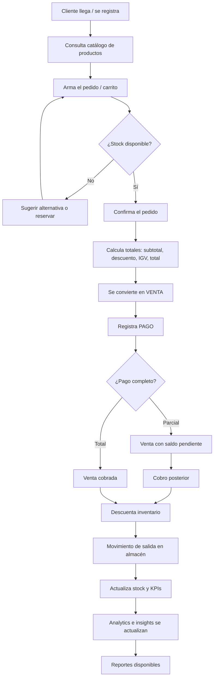
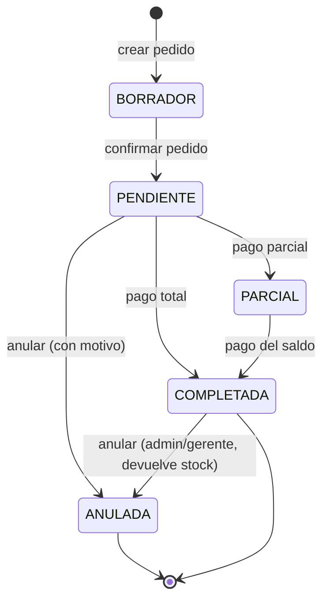
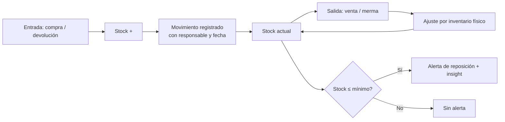
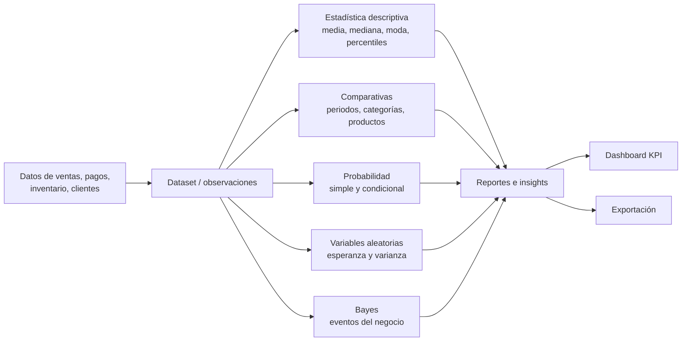

# Salesia Enterprise — Documento de Requisitos

| Campo | Valor |
|---|---|
| **Proyecto** | Salesia Enterprise |
| **Fase** | 01 — Análisis y levantamiento |
| **Versión** | 1.0 |
| **Estado** | Aprobado |
| **Equipo** | Grupo 4 — SENATI |
| **Fecha** | 01 de octubre de 2026 |

---

## 1. Problema

Las pequeñas y medianas empresas (PyMES) de comercio y retail gestionan sus ventas de forma manual o con hojas de cálculo aisladas. Esto provoca:

- **Pérdida de visibilidad del negocio:** no se sabe en tiempo real qué se vende, a qué precio ni a quién.
- **Descontrol de inventario:** faltantes, sobrestock y mermas se detectan tarde, cuando ya hay pérdida económica.
- **Decisiones por intuición:** los dueños deciden qué comprar, cómo pricear o a qué cliente fidelizar basándose en "lo que parece funcionar", sin evidencia.
- **Datos dispersos:** la información de clientes, ventas, pagos e inventario vive en libretas, Excel y WhatsApp, imposibilitando cualquier análisis.

**Problema central:**

> Las PyMES de comercio no cuentan con un sistema integrado que unifique la operación comercial (cliente → pedido → venta → pago → inventario) y, al mismo tiempo, convierta esos datos en **información estadística accionable** para la toma de decisiones.

---

## 2. Solución propuesta

**Salesia Enterprise** es una plataforma web de gestión empresarial con una capa de **Analytics estadístico** integrada. Captura la operación diaria del negocio y la transforma en indicadores, comparativas y modelos probabilísticos que responden preguntas reales del dueño:

- *¿Cuál es el ticket promedio de venta?*
- *¿Qué producto me deja más margen?*
- *¿Cuánto stock necesito para el próximo mes?*
- *¿Qué tan probable es que un cliente compre de nuevo?*
- *Si el cliente pidió X, ¿qué tan probable es que también compre Y?*

### 2.1 Objetivos

**Objetivo general**

> Diseñar e implementar una plataforma web que centralice la operación comercial de una PyME (clientes, pedidos, ventas, pagos e inventario) y ofrezca un módulo de análisis estadístico para apoyar la toma de decisiones.

**Objetivos específicos**

| # | Objetivo |
|---|---|
| OE-01 | Registrar y administrar clientes, productos y categorías. |
| OE-02 | Automatizar el flujo de pedido → venta → pago con cálculo automático de totales e impuestos. |
| OE-03 | Controlar el inventario con movimientos trazables (entrada, salida, ajuste, merma). |
| OE-04 | Calcular métricas estadísticas descriptivas (media, mediana, moda, percentiles, varianza, desviación) sobre ventas e inventario. |
| OE-05 | Comparar series de datos (periodos, categorías, productos) de forma visual. |
| OE-06 | Modelar probabilidades, variables aleatorias y razonamiento Bayesiano sobre eventos del negocio. |
| OE-07 | Generar reportes e insights automáticos exportables. |
| OE-08 | Controlar el acceso por roles con trazabilidad de acciones (auditoría). |

---

## 3. Alcance

### 3.1 Dentro del alcance (In-Scope)

| Módulo | Funcionalidades |
|---|---|
| **Autenticación y acceso** | Login, registro de usuarios, roles (Admin, Gerente, Vendedor, Almacenero), restablecimiento de contraseña. |
| **Clientes** | CRUD, historial de compras, segmentación básica. |
| **Productos y categorías** | CRUD, precio de venta/costo, SKU, stock mínimo, estado activo/inactivo. |
| **Ventas y pedidos** | Creación de pedido, carrito, cálculo de totales, descuentos, impuestos, anulación. |
| **Pagos** | Registro de pagos (efectivo, tarjeta, transferencia, yape/plin), estado del cobro, caja. |
| **Inventario** | Stock actual, movimientos (entrada/salida/ajuste/merma), alertas de stock mínimo. |
| **Analytics estadístico** | Media, mediana, moda, percentiles, varianza, desviación estándar; comparativas; histogramas y dispersión. |
| **Probabilidad** | Probabilidad simple y condicional, eventos independientes/dependientes. |
| **Variables aleatorias** | Distribuciones (discreta y continua), esperanza matemática, varianza. |
| **Bayes** | Teorema de Bayes aplicado a eventos del negocio (ej. probabilidad de recompra dado que el cliente compró categoría X). |
| **Reportes e insights** | Tablero KPI, reportes exportables, recomendaciones automáticas. |
| **Auditoría** | Registro de quién hizo qué cambio y cuándo. |

### 3.2 Fuera del alcance (Out-of-Scope) — Fase 01

- Pasarela de pagos en línea (se registra el pago manualmente).
- Facturación electrónica SUNAT / emisión de comprobantes.
- Módulo de compras a proveedores y órdenes de compra.
- Módulo de recursos humanos y planilla (solo existe `employee` como dato base).
- App móvil nativa.
- Multi-idioma y multi-moneda (español / PEN por defecto).
- Integración con marketplaces (Mercado Libre, Shopee, etc.).
- Pronóstico de demanda con Machine Learning (solo estadística clásica).

### 3.3 Supuestos

1. El negocio tiene al menos 3 meses de datos históricos cargables para que el Analytics tenga material.
2. Existe un usuario administrador inicial creado en la instalación.
3. El despliegue es on-premise o cloud única instancia, sin alta disponibilidad requerida en v1.
4. Los precios están en soles (PEN) con IGV incluido o desglosado configurable.

### 3.4 Restricciones

- Interfaz 100% en español.
- Compatible con navegadores actuales (Chrome, Edge, Firefox — últimos 2 versiones).
- Tiempo de respuesta API < 500 ms en operaciones CRUD bajo carga normal.
- Debe correr en contenedores Docker con un solo comando.

---

## 4. Usuarios y roles

| Código | Rol | Perfil | Objetivo principal |
|---|---|---|---|
| `ADMIN` | Administrador | Dueño o gerente general | Tener el control total: usuarios, configuración y visión global del negocio. |
| `GERENTE` | Gerente | Gerente de tienda/sucursal | Ver KPIs, reportes y decisiones de compra/precios. |
| `VENDEDOR` | Vendedor | Atención al mostrador | Registrar clientes y ventas rápidamente sin errores. |
| `ALMACEN` | Almacenero | Encargado de almacén | Mantener el stock correcto y registrar entradas/salidas. |

### 4.1 Matriz de permisos (RACI simplificado)

| Recurso / Acción | ADMIN | GERENTE | VENDEDOR | ALMACEN |
|---|:---:|:---:|:---:|:---:|
| Usuarios y roles | CRUD | — | — | — |
| Clientes | CRUD | CRUD | CR / U | — |
| Productos y categorías | CRUD | CRUD | R | R |
| Ventas / pedidos | CRUD | CRUD | CRU | R |
| Anular venta | CRUD | U | — | — |
| Pagos | CRUD | CRUD | CR | — |
| Inventario (movimientos) | CRUD | R | R | CRUD |
| Analytics / estadística | R | R | R | R |
| Reportes e insights | CRUD | CRUD | R | R |
| Auditoría | R | R | — | — |

> **R** = Read · **C** = Create · **U** = Update · **D** = Delete

---

## 5. Procesos del negocio

### 5.1 Proceso principal: `cliente → pedido → venta → pago → inventario`

### 5.2 Descripción paso a paso

| # | Paso | Actor | Entrada | Salida / Efecto | Regla clave |
|---|---|---|---|---|---|
| 1 | **Registro de cliente** | Vendedor | DNI/RUC, nombre, teléfono, email, dirección | Cliente creado (`customer`) | El documento debe ser único. |
| 2 | **Selección de productos** | Vendedor | Búsqueda por SKU/categoría | Líneas del carrito | Solo productos `activo = true`. |
| 3 | **Creación del pedido** | Vendedor | Carrito + cliente + fecha | Pedido con estado `PENDIENTE` | No permite exceder el stock. |
| 4 | **Cálculo de totales** | Sistema | Subtotal por línea | Subtotal, descuento, IGV, `total` | Recálculo automático ante cualquier cambio. |
| 5 | **Confirmación de venta** | Vendedor/Vendedor | Pedido confirmado | `sale` con estado `COMPLETADA` | Numeración correlativa e inmutable. |
| 6 | **Registro de pago** | Vendedor/Caja | Monto, medio de pago | `payment` vinculado a la venta | Estado: `PENDIENTE`, `PARCIAL`, `PAGADO`. |
| 7 | **Descuento de inventario** | Sistema | Detalle de la venta | `inventory_movement` tipo `SALIDA` | Stock nunca negativo. |
| 8 | **Actualización de KPIs** | Sistema | Nueva venta | Dashboard, reportes, insights | Consistencia eventual < 5 s. |

### 5.3 Diagrama de estados de la venta

### 5.4 Proceso de inventario

**Tipos de movimiento de inventario:**

| Tipo | Signo | Origen | Requiere responsable |
|---|---|---|---|
| `ENTRADA` | + | Compra a proveedor | Almacenero |
| `SALIDA` | − | Venta confirmada | Sistema (automático) |
| `DEVOLUCION` | + | Devolución de cliente | Vendedor |
| `MERMA` | − | Daño, vencimiento, robo | Almacenero |
| `AJUSTE` | ± | Inventario físico | Admin / Gerente |

### 5.5 Proceso de análisis (Analytics)

---

## 6. Datos necesarios para Analytics

### 6.1 Fuentes de datos

| Fuente | Tabla / Modelo | Campos clave aportados |
|---|---|---|
| Ventas | `sale`, `sale_detail` | fecha, total, cantidad, precio, descuento, estado |
| Pagos | `payment` | monto, medio de pago, fecha, estado |
| Inventario | `inventory`, `inventory_movement` | stock, costo, tipo de movimiento, fecha |
| Clientes | `customer` | fecha de alta, ciudad, segmento, antigüedad |
| Productos | `product`, `category` | precio, costo, categoría, SKU |
| Dataset externo | `dataset`, `dataset_variable`, `observation` | datos cargados por el usuario para análisis libre |

### 6.2 Variables requeridas

**Variables cuantitativas continuas**

| Variable | Descripción | Unidad | Origen |
|---|---|---|---|
| `monto_venta` | Total de cada venta | PEN | `sale.total` |
| `ticket_promedio` | Total vendido / nº de ventas | PEN | calculada |
| `margen_unitario` | Precio de venta − costo | PEN | `product` |
| `tiempo_entrega` | Días entre pedido y entrega | días | `sale` |
| `dias_entre_compras` | Frecuencia de recompra | días | `customer` + `sale` |

**Variables cuantitativas discretas**

| Variable | Descripción | Unidad | Origen |
|---|---|---|---|
| `cantidad_unidades` | Unidades por línea | uds | `sale_detail.quantity` |
| `numero_lineas` | Ítems distintos por venta | ítems | `sale_detail` |
| `stock_actual` | Existencias por producto | uds | `inventory.stock` |
| `numero_ventas_dia` | Ventas por jornada | ventas | `sale` |
| `numero_clientes_mes` | Clientes nuevos por mes | clientes | `customer` |

**Variables cualitativas (categóricas)**

| Variable | Valores posibles | Uso analítico |
|---|---|---|
| `categoria_producto` | Bebidas, Snacks, Lácteos, Abarrotes, Limpieza, Otros | Comparativa de venta por categoría |
| `medio_pago` | Efectivo, Tarjeta, Transferencia, Yape/Plin | Comportamiento de cobro |
| `estado_venta` | Borrador, Pendiente, Parcial, Completada, Anulada | Tasa de conversión y anulación |
| `segmento_cliente` | Nuevo, Recurrente, Frecuente, Inactivo | Fidelización |
| `ciudad` | Distrito/ciudad del cliente | Cobertura geográfica |
| `rol_usuario` | Admin, Gerente, Vendedor, Almacenero | Rendimiento por rol |

### 6.3 Indicadores y métricas derivadas

| # | Métrica | Fórmula | Periodicidad |
|---|---|---|---|
| KPI-01 | Ventas totales | Σ `sale.total` (estado = Completada) | Diaria / Mensual |
| KPI-02 | Número de ventas | COUNT(`sale`) | Diaria |
| KPI-03 | Ticket promedio | Ventas totales / Nº de ventas | Diaria |
| KPI-04 | Margen bruto | Σ(venta − costo) / Σ venta | Mensual |
| KPI-05 | Rotación de inventario | Costo de ventas / Stock promedio | Mensual |
| KPI-06 | Productos con stock bajo | COUNT(`stock ≤ mínimo`) | Diaria |
| KPI-07 | Tasa de anulación | Anuladas / Totales × 100 | Mensual |
| KPI-08 | Clientes nuevos | COUNT(`customer` con fecha en el periodo) | Mensual |
| KPI-09 | Recompra | Clientes con ≥2 compras / Total clientes × 100 | Mensual |
| KPI-10 | Cobranza pendiente | Σ saldo por cobrar | Diaria |

### 6.4 Análisis estadísticos requeridos

| Análisis | Módulo | Pregunta de negocio que resuelve |
|---|---|---|
| Media | `analytics/mean` | ¿Cuánto vendo en promedio? |
| Mediana | `analytics/median` | ¿Cuál es la venta "típica" sin que los atípicos me distorsionen? |
| Moda / percentiles | `analytics/variables` | ¿En qué rango se concentra el 80% de mis ventas? |
| Varianza y desviación | `analytics/variables` | ¿Qué tan estable es mi ingreso mes a mes? |
| Comparativa | `analytics/compare` | ¿Vendí más que el mes pasado? ¿Qué categoría creció? |
| Probabilidad simple | `analytics/probability` | ¿Qué probabilidad hay de que un producto se agote hoy? |
| Probabilidad condicional | `analytics/probability` | Si compró lácteos, ¿qué tan probable es que compre bebidas? |
| Variables aleatorias | `analytics/random_variables` | ¿Qué ingreso mensual puedo esperar y con qué riesgo? |
| Teorema de Bayes | `analytics/bayes` | Dado que el cliente devolvió, ¿qué tan probable es que sea un problema de calidad? |

### 6.5 Requisitos de calidad del dato

- **Completitud:** ≥ 95% de campos obligatorios diligenciados.
- **Unicidad:** documento de identidad, SKU y número de venta únicos.
- **Validez:** fechas en formato ISO-8601; montos ≥ 0 con 2 decimales.
- **Consistencia:** el stock resultante siempre = stock inicial + entradas − salidas.
- **Trazabilidad:** todo movimiento registra `usuario_id`, `fecha` y `motivo`.
- **Retención:** histórico de ventas no se borra; se marca como anulado (soft delete).

---

## 7. Casos de uso

**Leyenda:** *Principal* → actor principal. *Precondición* → estado previo. *Postcondición* → estado final.

### 7.1 Módulo de acceso

| ID | Caso de uso | Actor principal | Precondición | Flujo básico | Postcondición |
|---|---|---|---|---|---|
| CU-01 | Iniciar sesión | Cualquier usuario | Usuario registrado y activo | 1. Ingresa credenciales → 2. Valida → 3. Crea sesión → 4. Redirige según rol | Sesión iniciada, token emitido |
| CU-02 | Cerrar sesión | Usuario autenticado | Sesión activa | 1. Solicita salida → 2. Invalida token | Sesión terminada |
| CU-03 | Gestionar usuarios | ADMIN | Sesión ADMIN | 1. Lista usuarios → 2. Crea/edita/activa/desactiva → 3. Asigna rol | Usuario actualizado |
| CU-04 | Recuperar contraseña | CualUARIO con email | Email registrado | 1. Solicita → 2. Recibe enlace → 3. Define nueva clave | Clave actualizada |

### 7.2 Módulo comercial

| ID | Caso de uso | Actor principal | Precondición | Flujo básico | Postcondición |
|---|---|---|---|---|---|
| CU-05 | Registrar cliente | VENDEDOR | Sesión iniciada | 1. Abre formulario → 2. Ingresa datos → 3. Valida documento → 4. Guarda | Cliente creado |
| CU-06 | Editar cliente | VENDEDOR / GERENTE | Cliente existente | 1. Busca → 2. Modifica → 3. Guarda | Cliente actualizado |
| CU-07 | Buscar cliente | VENDEDOR | Sesión iniciada | 1. Escribe nombre/DNI → 2. Sistema lista coincidencias | Cliente localizado |
| CU-08 | Crear producto | ADMIN / GERENTE | Sesión con permiso | 1. Ingresa SKU, nombre, precio, costo, categoría, stock mínimo → 2. Guarda | Producto activo |
| CU-09 | Registrar pedido | VENDEDOR | Cliente y productos existentes | 1. Selecciona cliente → 2. Agrega líneas → 3. Valida stock → 4. Confirma | Pedido confirmado |
| CU-10 | Anular pedido | VENDEDOR / ADMIN | Pedido en borrador o pendiente | 1. Selecciona pedido → 2. Ingresa motivo → 3. Confirma | Pedido anulado |
| CU-11 | Registrar venta | VENDEDOR | Pedido confirmado | 1. Valida stock → 2. Calcula totales → 3. Emite venta numerada | Venta COMPLETADA |
| CU-12 | Registrar pago | VENDEDOR / ADMIN | Venta existente | 1. Selecciona venta → 2. Ingresa monto y medio → 3. Guarda | Pago registrado, estado actualizado |
| CU-13 | Anular venta | ADMIN / GERENTE | Venta no anulada | 1. Selecciona → 2. Motivo → 3. Confirma → 4. Devuelve stock | Venta ANULADA + stock repuesto |

### 7.3 Módulo de inventario

| ID | Caso de uso | Actor principal | Precondición | Flujo básico | Postcondición |
|---|---|---|---|---|---|
| CU-14 | Consultar stock | ALMACEN / ADMIN | Sesión iniciada | 1. Filtra por categoría/estado → 2. Lista productos y stock | Inventario visible |
| CU-15 | Registrar entrada | ALMACEN | Producto existente | 1. Selecciona producto → 2. Cantidad y motivo → 3. Confirma | Stock incrementado |
| CU-16 | Registrar salida manual | ALMACEN | Stock suficiente | 1. Selecciona → 2. Cantidad → 3. Motivo → 4. Confirma | Stock descontado |
| CU-17 | Registrar merma | ALMACEN / ADMIN | Producto existente | 1. Selecciona → 2. Cantidad → 3. Motivo obligatorio | Stock descontado + motivo auditado |
| CU-18 | Ajuste por inventario | ADMIN / GERENTE | Conteo físico realizado | 1. Ingresa cantidad real → 2. Sistema calcula diferencia → 3. Confirma | Stock igualado al físico |
| CU-19 | Alerta de stock mínimo | Sistema | Stock ≤ mínimo | 1. Detecta umbral → 2. Genera alerta e insight | Alerta visible en dashboard |

### 7.4 Módulo de Analytics y reportes

| ID | Caso de uso | Actor principal | Precondición | Flujo básico | Postcondición |
|---|---|---|---|---|---|
| CU-20 | Calcular estadística descriptiva | GERENTE / ADMIN | Datos de ventas | 1. Elige métrica y periodo → 2. Sistema calcula → 3. Muestra resultado + gráfico | Resultado mostrado |
| CU-21 | Comparar periodos o categorías | GERENTE / ADMIN | ≥ 2 series | 1. Selecciona series → 2. Elige métrica → 3. Compara | Comparativa visual |
| CU-22 | Calcular probabilidad | GERENTE / ADMIN | Datos suficientes | 1. Define eventos → 2. Sistema calcula P(A), P(A\|B) | Probabilidad mostrada |
| CU-23 | Modelar variable aleatoria | GERENTE / ADMIN | Distribución definida | 1. Elige distribución → 2. Parámetros → 3. Calcula E(X), V(X) | Modelo y gráfico |
| CU-24 | Análisis Bayesiano | GERENTE / ADMIN | Eventos y probabilidades base | 1. Define previa, verosimilitud y evidencia → 2. Calcula posterior | Posterior + interpretación |
| CU-25 | Cargar dataset externo | ADMIN / GERENTE | Archivo CSV/Excel válido | 1. Sube archivo → 2. Mapea variables → 3. Valida → 4. Confirma | Dataset disponible |
| CU-26 | Generar reporte | GERENTE / ADMIN | Datos disponibles | 1. Elige tipo y periodo → 2. Genera → 3. Exporta | Reporte descargable |
| CU-27 | Ver dashboard | Todos (según rol) | Sesión iniciada | 1. Ingresa → 2. Sistema carga KPIs | KPIs y tendencias visibles |

### 7.5 Módulo de auditoría

| ID | Caso de uso | Actor principal | Precondición | Flujo básico | Postcondición |
|---|---|---|---|---|---|
| CU-28 | Consultar bitácora | ADMIN | Sesión ADMIN | 1. Filtra por fecha/usuario/acción → 2. Lista eventos | Auditoría visible |

---

## 8. Reglas de negocio

### 8.1 Clientes y productos

| ID | Regla |
|---|---|
| RN-01 | El documento de identidad (DNI/RUC) del cliente debe ser **único** en el sistema. |
| RN-02 | Un cliente con ventas pendientes de pago **no puede ser eliminado**, solo desactivado. |
| RN-03 | El SKU del producto debe ser único y auto-generable. |
| RN-04 | Un producto solo es vendible si `estado = ACTIVO` y `stock > 0`. |
| RN-05 | `precio_venta` debe ser mayor o igual que `precio_costo` (se permite precio a costo con aprobación de ADMIN). |
| RN-06 | Todo producto debe pertenecer a **una y solo una** categoría. |

### 8.2 Ventas y pagos

| ID | Regla |
|---|---|
| RN-10 | La cantidad solicitada **nunca** puede superar el stock disponible. |
| RN-11 | Los totales se recalculan **siempre** en el servidor; el cliente no envía el total final. |
| RN-12 | El número de venta es correlativo, único e **inmutable** una vez emitida. |
| RN-13 | El descuento por línea no puede superar el 100% del subtotal de esa línea. |
| RN-14 | Solo ADMIN y GERENTE pueden anular una venta ya cobrada. |
| RN-15 | Anular una venta devuelve **exactamente** las unidades al inventario. |
| RN-16 | Un pago no puede exceder el saldo pendiente de la venta. |
| RN-17 | Una venta queda en estado `PAGADO` solo cuando `Σ pagos = total`. |
| RN-18 | Toda anulación exige un **motivo** obligatorio de al menos 10 caracteres. |
| RN-19 | No se pueden registrar ventas con fecha futura. |

### 8.3 Inventario

| ID | Regla |
|---|---|
| RN-20 | El stock **nunca** puede quedar negativo. Si no alcanza, la operación se rechaza. |
| RN-21 | Cada movimiento de inventario debe tener responsable, fecha y motivo. |
| RN-22 | Las mermas y ajustes solo los realiza ADMIN, GERENTE o ALMACEN. |
| RN-23 | El stock resultante debe cumplir siempre: `inicial + Σentradas − Σsalidas = actual`. |
| RN-24 | Al stock ≤ `stock_minimo` se genera automáticamente una alerta y un insight. |

### 8.4 Seguridad y auditoría

| ID | Regla |
|---|---|
| RN-30 | Las contraseñas se almacenan con hash (bcrypt/argon2), **nunca** en texto plano. |
| RN-31 | Tras 5 intentos fallidos, la cuenta se bloquea 15 minutos. |
| RN-32 | Los tokens de sesión expiran en 8 horas y no son reutilizables. |
| RN-33 | Un usuario no puede modificar su propio rol ni elevar sus permisos. |
| RN-34 | Toda operación de escritura en datos sensibles genera registro en `audit_log`. |
| RN-35 | Un usuario desactivado pierde el acceso **de inmediato** (sin esperar expiración de token). |

### 8.5 Analytics

| ID | Regla |
|---|---|
| RN-40 | Todo cálculo estadístico requiere un mínimo de **2 observaciones**; si no, se responde "datos insuficientes". |
| RN-41 | La mediana y los percentiles se calculan sobre datos **ordenados**; se debe indicar si se usan datos atípicos. |
| RN-42 | Al mostrar la media se debe mostrar también la desviación estándar para dar contexto. |
| RN-43 | El teorema de Bayes exige que `P(B) > 0`; caso contrario se rechaza con mensaje claro. |
| RN-44 | Las ventas con estado `ANULADA` **se excluyen** de todo cálculo estadístico por defecto. |
| RN-45 | Todo resultado analítico muestra el periodo, el número de observaciones y la fecha de cálculo. |
| RN-46 | Un dataset externo debe declarar el tipo de cada variable (cualitativa/cuantitativa) antes de analizarse. |

---

## 9. Criterios de aceptación

### 9.1 Generales

| ID | Criterio | Verificación |
|---|---|---|
| CA-01 | El sistema despliega con `docker compose up` sin pasos manuales adicionales. | Prueba de instalación |
| CA-02 | Ningún archivo de configuración secreto (`.env`) se incluye en el repositorio. | Revisión de repo |
| CA-03 | Toda respuesta de error de la API usa el formato `{ codigo, mensaje, detalle }`. | Pruebas de API |
| CA-04 | Toda API protegida devuelve `401` sin token y `403` con rol insuficiente. | Pruebas de autorización |
| CA-05 | El 100% de las rutas críticas tiene cobertura de pruebas (unitarias + API + integración). | Reporte de cobertura ≥ 80% |

### 9.2 Funcionales

| ID | Criterio | Dado / Cuando / Entonces |
|---|---|---|
| CA-10 | Registro de cliente | **Dado** un DNI duplicado **Cuando** se guarda **Entonces** responde `409` y no crea el registro. |
| CA-11 | Venta con stock insuficiente | **Dado** un producto con stock 3 **Cuando** se piden 5 **Entonces** se rechaza y el stock no cambia. |
| CA-12 | Cálculo de totales | **Dado** 2 ítems con descuento **Cuando** se emite la venta **Entonces** `total = Σ(precio×cant) − descuento + IGV` con 2 decimales exactos. |
| CA-13 | Numeración de venta | **Dado** que existe la venta N.º 100 **Cuando** se emite otra **Entonces** recibe N.º 101, sin repetir ni saltar. |
| CA-14 | Pago parcial | **Dado** una venta de S/ 200 **Cuando** se paga S/ 100 **Entonces** el estado es `PARCIAL` y el saldo es S/ 100. |
| CA-15 | Anulación con devolución | **Dado** una venta de 4 unidades **Cuando** se anula **Entonces** el stock sube 4 unidades y queda registro de auditoría. |
| CA-16 | Stock no negativo | **Dado** stock 0 **Cuando** se intenta una salida **Entonces** se responde `400` con mensaje "stock insuficiente". |
| CA-17 | Alerta de stock mínimo | **Dado** `stock_minimo = 10` **Cuando** el stock llega a 10 **Entonces** aparece la alerta en el dashboard. |
| CA-18 | Exclusión de anuladas | **Dado** ventas completadas y anuladas **Cuando** se calcula el ticket promedio **Entonces** las anuladas no entran al cálculo. |

### 9.3 Analíticas

| ID | Criterio | Dado / Cuando / Entonces |
|---|---|---|
| CA-20 | Media | **Dado** `{10, 20, 30, 40}` **Cuando** se calcula la media **Entonces** devuelve `25.0`. |
| CA-21 | Mediana par | **Dado** `{10, 20, 30, 40}` **Cuando** se calcula la mediana **Entonces** devuelve `25.0`. |
| CA-22 | Mediana impar | **Dado** `{7, 3, 9}` **Cuando** se calcula la mediana **Entonces** devuelve `7`. |
| CA-23 | Datos insuficientes | **Dado** 1 observación **Cuando** se pide cualquier métrica **Entonces** responde "datos insuficientes" y no `NaN`. |
| CA-24 | Probabilidad condicional | **Dado** `P(A∩B)=0.12` y `P(B)=0.4` **Cuando** se calcula `P(A\|B)` **Entonces** devuelve `0.3`. |
| CA-25 | Bayes válido | **Dado** `P(A)=0.3`, `P(B\|A)=0.8`, `P(B)=0.5` **Cuando** se aplica Bayes **Entonces** `P(A\|B) = 0.48`. |
| CA-26 | Bayes inválido | **Dado** `P(B)=0` **Cuando** se aplica Bayes **Entonces** responde error `422` con mensaje en español. |
| CA-27 | Esperanza de VA discreta | **Dado** `X` con `P(1)=0.3`, `P(2)=0.5`, `P(3)=0.2` **Cuando** se calcula `E(X)` **Entonces** devuelve `1.9`. |
| CA-28 | Comparativa | **Dado** dos meses **Cuando** se comparan **Entonces** muestra diferencia absoluta y porcentual. |
| CA-29 | Reproducibilidad | **Dado** los mismos datos **Cuando** se repite el cálculo **Entonces** el resultado es idéntico. |

### 9.4 No funcionales

| ID | Criterio | Meta |
|---|---|---|
| CA-30 | Rendimiento API (CRUD) | ≤ 500 ms (p95) |
| CA-31 | Rendimiento de análisis sobre 100k registros | ≤ 3 s |
| CA-32 | Disponibilidad | ≥ 99% en horario de operación |
| CA-33 | Tiempo de carga del dashboard | ≤ 2 s en red local |
| CA-34 | Compatibilidad | Últimas 2 versiones de Chrome, Edge y Firefox |
| CA-35 | Accesibilidad | Contraste AA y navegación completa por teclado |
| CA-36 | Responsive | Uso válido en tablet y móvil desde 360 px |
| CA-37 | Backups | Respaldo diario automático de PostgreSQL con restauración probada |
| CA-38 | Idioma | 100% de la interfaz en español |

---

## 10. Requerimientos funcionales y no funcionales

### 10.1 Requerimientos funcionales

| ID | Requerimiento | Prioridad |
|---|---|---|
| RF-01 | Sistema de autenticación con roles y permisos | Alta |
| RF-02 | Gestión de clientes (CRUD + historial) | Alta |
| RF-03 | Gestión de productos y categorías | Alta |
| RF-04 | Registro de pedidos y ventas con cálculo automático | Alta |
| RF-05 | Registro de pagos y control de saldos | Alta |
| RF-06 | Control de inventario con movimientos | Alta |
| RF-07 | Dashboard con KPIs | Alta |
| RF-08 | Estadística descriptiva (media, mediana, moda, percentiles, varianza) | Alta |
| RF-09 | Comparativas de series | Media |
| RF-10 | Módulo de probabilidad | Media |
| RF-11 | Módulo de variables aleatorias | Media |
| RF-12 | Módulo Bayesiano | Media |
| RF-13 | Reportes exportables | Media |
| RF-14 | Insights y recomendaciones automáticas | Media |
| RF-15 | Carga de datasets externos (CSV/Excel) | Baja |
| RF-16 | Bitácora de auditoría | Media |

### 10.2 Requerimientos no funcionales

| ID | Requerimiento | Prioridad |
|---|---|---|
| RNF-01 | Arquitectura desacoplada: React + API Python + PostgreSQL | Alta |
| RNF-02 | API REST con versionado (`/api/v1`) | Alta |
| RNF-03 | Migraciones de base de datos trazables (Alembic) | Alta |
| RNF-04 | Despliegue mediante contenedores Docker | Alta |
| RNF-05 | Logs estructurados con correlación de peticiones | Media |
| RNF-06 | Cifrado TLS en tránsito y hash de contraseñas | Alta |
| RNF-07 | Validación de entrada en cliente y servidor | Alta |
| RNF-08 | Separación por ambientes: `dev`, `test`, `prod` | Media |
| RNF-09 | Documentación OpenAPI/Swagger generada desde el código | Media |
| RNF-10 | Cobertura de pruebas ≥ 80% | Media |

---

## 11. Estrategia de validación

| Nivel | Tipo | Herramienta prevista | Ejemplos |
|---|---|---|---|
| 1 | Unitaria | pytest | `test_mean.py`, `test_median.py`, `test_bayes.py`, `test_probability.py` |
| 2 | API | pytest + HTTPX | `test_auth.py`, `test_statistics.py` |
| 3 | Integración | pytest | `test_sales_flow.py`, `test_inventory.py` |
| 4 | Aceptación | Checklist manual | Recorrido del proceso completo 5.1 |
| 5 | Rendimiento | Locust / k6 | CA-30, CA-31 |

---

## 12. Riesgos

| ID | Riesgo | Probabilidad | Impacto | Mitigación |
|---|---|---|---|---|
| R-01 | Datos históricos insuficientes para el Analytics | Alta | Alto | Plantilla de carga masiva + dataset de demostración. |
| R-02 | Cálculos estadísticos incorrectos | Media | Alto | Suite de pruebas unitarias con valores de referencia. |
| R-03 | Desconciliación de stock | Media | Alto | Validación en servidor y recálculo por eventos. |
| R-04 | Pérdida de datos | Baja | Crítico | Backups automáticos + restauración probada. |
| R-05 | Acceso no autorizado | Media | Alto | RBAC + auditoría + bloqueo por intentos. |
| R-06 | Alcance descontrolado (*scope creep*) | Alta | Medio | Lista formal de fuera de alcance (§3.2). |

---

## 13. Glosario

| Término | Definición |
|---|---|
| **Pedido** | Intención de compra registrada antes de emitir la venta. |
| **Venta** | Operación confirmada con numeración, líneas y totales. |
| **Pago** | Movimiento de cobro asociado a una venta. |
| **Ticket promedio** | Valor medio de cada venta. |
| **Merma** | Pérdida de inventario por daño, vencimiento o robo. |
| **KPI** | Indicador clave de desempeño. |
| **Estadística descriptiva** | Resumen de datos mediante media, mediana, moda y dispersión. |
| **Probabilidad condicional** | Probabilidad de A sabiendo que ocurrió B: P(A\|B). |
| **Teorema de Bayes** | Método para actualizar una probabilidad al llegar nueva evidencia. |
| **Variable aleatoria** | Variable cuyo valor depende del azar, con distribución asociada. |
| **Dataset** | Conjunto de datos estructurado para análisis. |
| **Auditoría** | Bitácora inmutable de acciones sobre datos sensibles. |

---

## 14. Aprobación de la fase

| Rol | Nombre | Fecha | Estado |
|---|---|---|---|
| Líder de proyecto | | | ⬜ Pendiente |
| Product Owner | | | ⬜ Pendiente |
| Revisor técnico | | | ⬜ Pendiente |

**Condición de salida de la Fase 01:** todos los entregables de §1–§9 aprobados y con al menos **10 casos de uso** y **25 reglas de negocio** validados por el Product Owner.

---

*Documento generado en el marco de la Fase 01 — Análisis y levantamiento. Salesia Enterprise, Grupo 4 — SENATI.*
