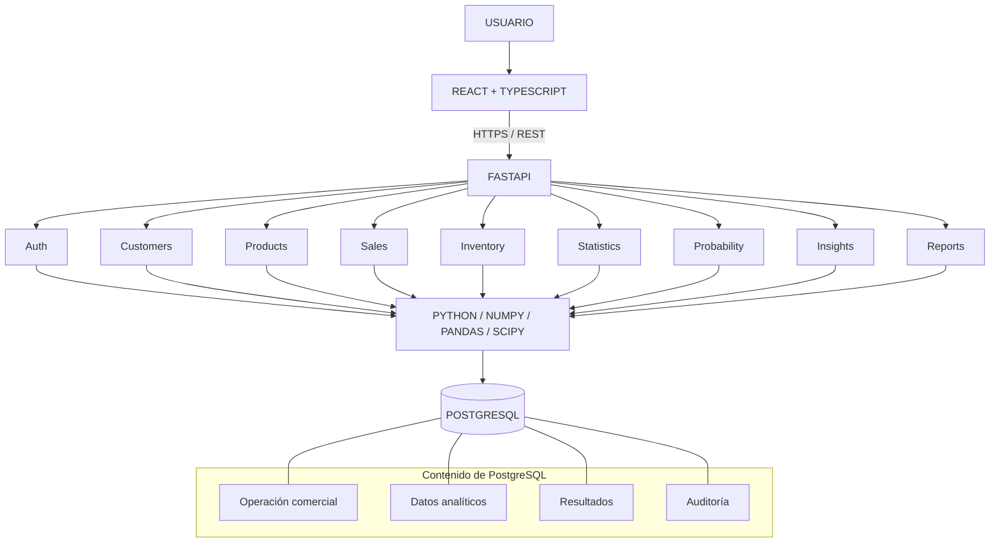
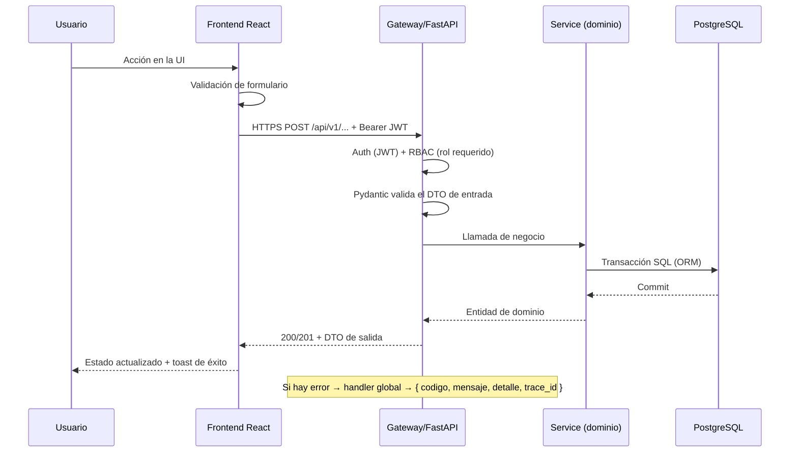
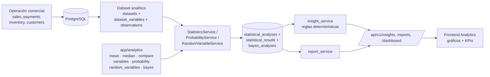
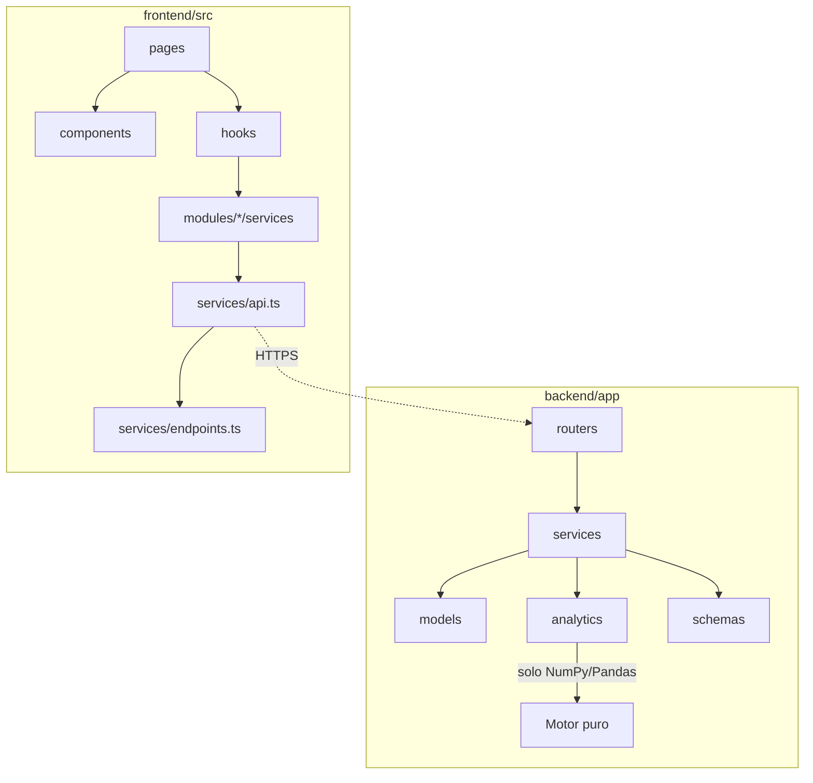
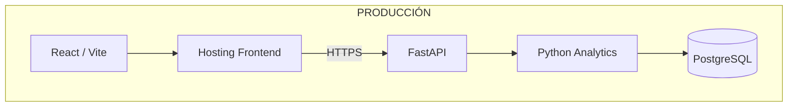
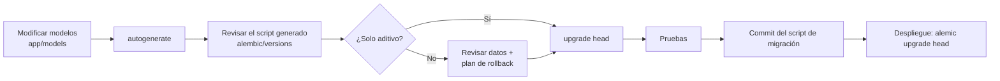
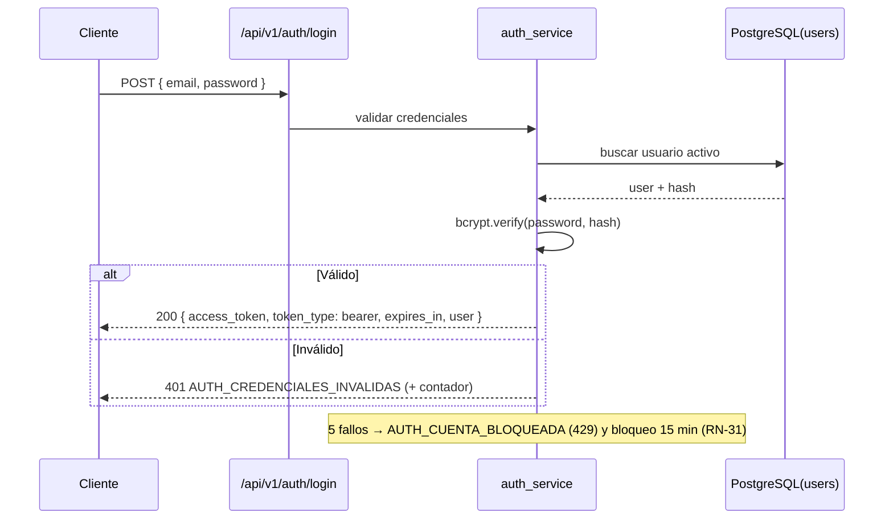

# SalesIA Enterprise — Documento de Arquitectura Técnica

> **Entregable FASE 02 – Arquitectura técnica:**
> *"Arquitectura, módulos, estructura de carpetas, contratos API y decisiones tecnológicas."*
>
> Fuente normativa: *SalesIA Enterprise — Plan Integral de Desarrollo v1.0*.
> Contrato REST detallado en [`docs/05_api.md`](05_api.md).

| Campo | Valor |
|---|---|
| **Documento** | Arquitectura técnica y estructura — SalesIA Enterprise |
| **Fase** | FASE 02 — Arquitectura técnica |
| **Versión** | 1.0 |
| **Stack** | React + TypeScript · Python/FastAPI · PostgreSQL |
| **Base académica** | Semana 07 — Estadística aplicada |
| **Estado** | En revisión |
| **Equipo** | Grupo 4 — SENATI |
| **Fecha** | 01 de octubre de 2026 |
| **Predecesor** | [`docs/01_requisitos.md`](01_requisitos.md) (v1.1) |

---

## 0. Cumplimiento de la FASE 02

| Requisito de la fase | Sección | Estado |
|---|---|---|
| Separar frontend React, API Python y PostgreSQL | §1, §2, §3 | ✅ |
| Definir módulos por dominio | §5, §6, §7 | ✅ |
| Definir DTO/schemas y contratos REST | §9 + `docs/05_api.md` | ✅ |
| Definir manejo de errores, autenticación y autorización | §10, §11 | ✅ |
| Definir estrategia de migraciones y ambientes | §12, §13 | ✅ |

---

## 1. Principios arquitectónicos

| # | Principio | Implicación |
|---|---|---|
| P-01 | **Las ventas generan los datos** | No existe un módulo estadístico aislado: todo cálculo proviene de la operación comercial persistida en PostgreSQL. |
| P-02 | **Separación de capas** | Presentación (React), lógica de negocio (servicios), persistencia (modelos/PostgreSQL). Sin lógica de negocio en el frontend ni en los routers (RNF-08). |
| P-03 | **Modularidad por dominio** | Cada dominio agrupa router → schema → service → model. Cambiar un dominio no rompe a los demás (RNF-01). |
| P-04 | **El servidor manda** | Totales, stock y cálculos estadísticos se resuelven siempre en el backend (RN-11, RN-23). |
| P-05 | **API primero** | El contrato REST (`05_api.md`) es la frontera oficial entre frontend y backend; se versiona en `/api/v1`. |
| P-06 | **Configuración por entorno** | Ningún secreto en el código; todo por variables de entorno (RNF-10, RN-36). |
| P-07 | **Trazabilidad por defecto** | Escrituras críticas generan `audit_logs`; errores generan `trace_id`. |
| P-08 | **Despliegue reproducible** | `docker compose up` levanta el sistema completo (CA-01 de Fase 01). |

---

## 2. Arquitectura general

### 2.1 Diagrama de capas (oficial del plan)



### 2.2 Componentes y responsabilidades

| Componente | Tecnología | Responsabilidad | NO debe hacer |
|---|---|---|---|
| **Frontend** | React 18 + TypeScript + Vite + Tailwind | Presentación, validación inmediata, consumo de API, gráficos | Calcular totales, persistir datos, validar con autoridad |
| **API** | FastAPI + Pydantic + Uvicorn | Contrato REST, validación, autorización, lógica de negocio, motor estadístico | Almacenar secreto en código, servir HTML estático de negocio |
| **Motor estadístico** | NumPy / Pandas / SciPy (`app/analytics`) | Media, mediana, comparación, variables, probabilidad, Bayes | Acceder directamente a la BD (lo hace vía servicios) |
| **Base de datos** | PostgreSQL 16 | Persistencia, integridad referencial, índices, auditoría | Contener lógica de negocio compleja |
| **Migraciones** | Alembic | Evolución versionada del esquema | Modificar datos de producción sin rollback probado |
| **Orquestación** | Docker Compose | Levantar `postgres`, `backend`, `frontend` | Gestionar secretos en imágenes |

### 2.3 Secuencia de una petición



### 2.4 Flujo del motor estadístico



---

## 3. Stack tecnológico y decisiones

| Capa | Elección | Versión objetivo | Justificación |
|---|---|---|---|
| Frontend | React + TypeScript | 18.x / 5.x | Exigido por el plan; tipado estricto para los DTO de la API |
| Bundler | Vite | 5.x | Arranque rápido, HMR, build simple (`vite.config.ts` presente) |
| Estilos | Tailwind CSS | 3.x | Sistema de diseño de la FASE 03 (azul corporativo, cyan, blanco, grises) |
| HTTP | `fetch` + cliente tipado | — | `src/services/api.ts` centraliza headers, errores y token |
| Gráficos | Librería de charts | a definir FASE 10 | Componentes `components/charts/` ya reservados |
| API | FastAPI | 0.11x | OpenAPI automático (RNF-05), validación Pydantic, async |
| Validación | Pydantic v2 | 2.x | DTO de entrada/salida + esquemas OpenAPI |
| ORM | SQLAlchemy 2.x | 2.x | Modelos `app/models/*`, integridad referencial (RNF-03) |
| Migraciones | Alembic | 1.x | `alembic.ini` + `alembic/versions` |
| Auth | OAuth2 + JWT (bcrypt) | — | Autenticación sin estado, autorización por rol |
| Analítica | NumPy / Pandas / SciPy | — | Requerido por el plan para el motor estadístico |
| BD | PostgreSQL | 16 | Multiusuario, transacciones, índices, JSON |
| Pruebas | Pytest + HTTPX | 7.x | Niveles unitario / API / integración |
| Contenedores | Docker + Compose | — | CA-01 |
| Logs | `logging` estructurado (JSON) | — | RNF-11, trazabilidad |

---

## 4. Estructura de carpetas definitiva

### 4.1 Árbol del repositorio

```
salesia-enterprise/
├── .env.example                  # Plantilla de variables de entorno (sin secretos)
├── .gitignore
├── docker-compose.yml            # postgres + backend + frontend
├── README.md
├── backend/
│   ├── Dockerfile
│   ├── alembic.ini
│   ├── requirements.txt
│   ├── alembic/
│   │   ├── env.py
│   │   ├── versions/             # Migraciones versionadas (FASE 04)
│   │   └── seeds.py              # Datos semilla ejecutable (FASE 04)
│   └── app/
│       ├── main.py               # Factory de la app FastAPI
│       ├── api/
│       │   ├── deps.py           # Dependencias: sesión, rol actual
│       │   └── v1/
│       │       ├── router.py     # Agrupador /api/v1/*
│       │       └── routers/      # Un router por recurso REST
│       ├── core/
│       │   ├── config.py         # Settings por entorno (pydantic-settings)
│       │   ├── database.py       # Engine, SessionLocal, Base
│       │   ├── security.py       # Hash, JWT, verificación
│       │   ├── exceptions.py     # Excepciones de dominio
│       │   └── logging.py        # Configuración de logs
│       ├── models/               # 22 entidades SQLAlchemy
│       ├── schemas/              # DTO Pydantic (entrada/salida)
│       ├── services/             # Lógica de negocio transaccional
│       ├── analytics/            # Motor estadístico puro (sin I/O)
│       │   ├── mean.py  median.py  compare.py  variables.py
│       │   ├── probability.py  random_variables.py  bayes.py
│       ├── utils/                # helpers.py, validators.py
│       └── tests/
│           ├── unit/             # Motor estadístico y validadores
│           ├── api/              # Endpoints, códigos, permisos
│           └── integration/      # Venta → inventario → persistencia
├── frontend/
│   ├── index.html  package.json  tsconfig.json  vite.config.ts  tailwind.config.js
│   └── src/
│       ├── main.tsx
│       ├── app/                  # App.tsx, router.tsx, providers.tsx
│       ├── layouts/              # MainLayout, AuthLayout, Sidebar
│       ├── components/           # Kit de UI compartido (FASE 03/06)
│       │   ├── ui/  tables/  feedback/  charts/
│       ├── modules/              # Un módulo por dominio de negocio
│       │   ├── auth/  dashboard/  customers/  products/  sales/
│       │   ├── inventory/  analytics/  probability/  insights/  reports/
│       │   └── (cada uno: components/ pages/ services/)
│       ├── hooks/                # useAuth, useSales, useStatistics, useInsights
│       ├── services/             # api.ts (cliente HTTP), endpoints.ts
│       ├── types/                # Tipos TS espejo de los DTO
│       ├── utils/                # constants, formatters, validators
│       └── styles/globals.css
├── database/                     # ⇦ RESUELTO: ver §4.3 (no aplica)
└── docs/
    ├── 01_requisitos.md  02_arquitectura.md  03_ux_ui.md
    ├── 04_modelo_er.md   05_api.md           06_motor_estadistico.md
    └── 07_manual_usuario.md
```

### 4.2 Desviaciones plan ↔ repositorio y resolución

Heredadas de `01_requisitos.md` §16. **Esta fase las resuelve formalmente:**

| ID | Desviación | Decisión de arquitectura | Responsable / Fase |
|---|---|---|---|
| D-01 | El plan define `app/statistics/`, `app/probability/`, `app/reports/`; el repo usa `app/analytics/` | **AR-01:** se confirma `app/analytics/` como paquete único del motor estadístico (media, mediana, comparación, variables, aleatorias, probabilidad, Bayes). Reportes viven en `services/report_service.py`. Motivo: un solo responsable técnico y pruebas unitarias en un solo lugar. | Aprobado FASE 02 |
| D-02 | El plan define `database/migrations/` y `database/seeds/`; el repo usa `backend/alembic/` sin `seeds/` | **AR-02:** migraciones en `backend/alembic/versions/` (junto a `alembic.ini`); datos semilla en `backend/alembic/seeds.py`. **No se crea la carpeta `database/` en la raíz** para evitar una fuente de verdad duplicada. | FASE 04 |
| D-03 | `frontend/src/components/` estaba vacío | **AR-03:** se mantiene como kit de UI compartido con 4 subcarpetas ya creadas: `ui/`, `tables/`, `feedback/`, `charts/`. Los módulos solo importan de aquí, nunca entre sí. | FASE 03 / 06 |
| D-04 | **RF-05 Gestión de vendedores sin implementación** (solo `models/employee.py`) | **AR-04:** se crea el stack completo: `routers/employees.py`, `schemas/employee.py`, `services/employee_service.py` y módulo frontend `modules/employees/`. ⚠️ **Requiere aprobación del Product Owner** por añadir un undécimo módulo frontend fuera de la lista oficial de 10. Alternativa descartada: pestaña dentro de `sales/` (mezcla dominios). | PO + FASE 07 |

### 4.3 Fuera de la estructura

- **`database/` (raíz):** no se crea — ver AR-02.
- **`frontend/src/components/ui` genérico tipo "carpeta de reciclaje":** prohibido; todo componente compartido va en el kit, lo específico del dominio vive en `modules/<dominio>/components/`.

---

## 5. Módulos por dominio — backend

### 5.1 Mapa de dominios

| # | Dominio | Modelos | Router | Service | Schemas | Frontend |
|---|---|---|---|---|---|---|
| D1 | **Identidad y acceso** | `user`, `role` | `auth.py` | `auth_service.py` | `auth` | `modules/auth` |
| D2 | **Maestros** | `customer` | `customers.py` | `customer_service.py` | `customer` | `modules/customers` |
| | | `product`, `category` | `products.py` | `product_service.py` | `product` | `modules/products` |
| | | `employee` | `employees.py` *(AR-04)* | `employee_service.py` | `employee` | `modules/employees` |
| D3 | **Ventas y cobros** | `sale`, `sale_detail` | `sales.py` | `sale_service.py` | `sale` | `modules/sales` |
| | | `payment` | *(dentro de sales)* | `sale_service.py` | `sale` | `modules/sales` |
| D4 | **Inventario** | `inventory`, `inventory_movement` | `inventory.py` | `inventory_service.py` | *(nuevo)* | `modules/inventory` |
| D5 | **Analítica de datos** | `dataset`, `dataset_variable`, `observation` | `statistics.py` | `statistics_service.py` | `statistics` | `modules/analytics` |
| D6 | **Probabilidad** | `random_variable`, `bayes_analysis` | `probability.py`, `random_variables.py` | `probability_service.py`, `random_variable_service.py` | `probability` | `modules/probability` |
| D7 | **Inteligencia** | `insight` | `insights.py` | `insight_service.py` | `insight` | `modules/insights` |
| D8 | **Reportes** | `report` | `reports.py` | `report_service.py` | `report` | `modules/reports` |
| D9 | **Tablero** | *(vista agregada)* | `dashboard.py` | `statistics_service.py` | `statistics` | `modules/dashboard` |
| D10 | **Plataforma** | `company`, `audit_log` | *(admin)* | *(core)* | — | — |

**11 routers existentes:** `auth, customers, dashboard, insights, inventory, probability, products, random_variables, reports, sales, statistics` — cubren D1–D9 salvo `employees` (AR-04).

### 5.2 Reglas de dependencia entre módulos



| Regla | Detalle |
|---|---|
| RD-1 | `routers/` **no** contiene lógica de negocio: solo valida con schema, llama a `service` y devuelve DTO. |
| RD-2 | `services/` **no** conoce HTTP: recibe objetos Pydantic, opera `models/` dentro de sesión/transacción. |
| RD-3 | `analytics/` es **funcional puro**: funciones puras sobre `list[float]` o `DataFrame`; sin BD, sin HTTP, sin estado global. Fácil de unit-testear. |
| RD-4 | `models/` no expone JSON; la salida siempre pasa por `schemas/`. |
| RD-5 | Un servicio puede invocar a otro solo dentro del mismo dominio o hacia abajo (ventas → inventario). Nunca hacia arriba. |
| RD-6 | El frontend consume la API **solo** vía `modules/<dom>/services` → `services/api.ts`. Prohibido `fetch` disperso. |
| RD-7 | Un módulo frontend no importa componentes de otro módulo; comparte únicamente vía `src/components/`. |

---

## 6. Módulos por dominio — frontend

| Módulo | Rutas | Páginas | Responsabilidad |
|---|---|---|---|
| `auth` | `/login` | `LoginPage` | Login, recuperación de clave |
| `dashboard` | `/` | `DashboardPage` | KPIs ejecutivos, filtros por periodo/sucursal/vendedor/categoría |
| `customers` | `/clientes` | `CustomersPage` | CRUD, ficha, historial de compras |
| `products` | `/productos` | `ProductsPage` | CRUD, categorías, precios, estado |
| `sales` | `/ventas`, `/ventas/:id` | `SalesPage`, `SaleDetailPage` | Carrito, emisión, pagos, historial |
| `inventory` | `/inventario` | `InventoryPage` | Stock, movimientos, alertas |
| `analytics` | `/analytics` | `AnalyticsPage` | Media, mediana, comparación, variables, gráficos |
| `probability` | `/probabilidad` | `ProbabilityPage` | Probabilidades, variables aleatorias, Bayes |
| `insights` | `/insights` | `InsightsPage` | Lista, detalle y evidencia numérica |
| `reports` | `/reportes` | `ReportsPage` | Generación, exportación e impresión |
| `employees` | `/vendedores` | `EmployeesPage` | **AR-04 — pendiente de aprobación PO** |

**Estructura interna estándar de un módulo:**

```
modules/<dominio>/
├── pages/         # Página/ruta: compone componentes y llama hooks
├── components/    # Componentes propios del dominio
└── services/      # Cliente del endpoint de este dominio (tipado)
```

---

## 7. Ambientes y estrategia de despliegue

### 7.1 Ambientes

| Ambiente | URL base | BD | Datos | `ENVIRONMENT` | `DEBUG` |
|---|---|---|---|---|---|
| **local (dev)** | `localhost:5173` → `localhost:8000` | `salesia_dev` | Seed de demostración | `development` | `true` |
| **test** | interna (CI) | `salesia_test` | Datos sintéticos por corrida, BD desechable | `testing` | `false` |
| **producción** | dominio real + HTTPS | `salesia_prod` | Datos reales + backups diarios | `production` | `false` |

**Reglas:**
- Las migraciones corren **antes** del build de la imagen en cada despliegue: `alembic upgrade head`.
- La rama `main` despliega a producción solo si `test` pasó (FASE 14).
- Ningún ambiente comparte la misma base de datos.
- `DEBUG=true` está prohibido en `production` (el validador de `config.py` lo rechaza al arrancar).

### 7.2 Variables de entorno

| Variable | Propósito | Ejemplo |
|---|---|---|
| `ENVIRONMENT` | Ambiente activo | `development` / `testing` / `production` |
| `DATABASE_URL` | Conexión PostgreSQL | `postgresql+psycopg://salesia:***@db:5432/salesia_dev` |
| `SECRET_KEY` | Firma del JWT | *(solo por variable de entorno, nunca en repo — RN-36)* |
| `ALGORITHM` | Algoritmo JWT | `HS256` |
| `ACCESS_TOKEN_EXPIRE_MINUTES` | Vigencia del token | `480` (8 h, RN-32) |
| `CORS_ORIGINS` | Orígenes permitidos | `http://localhost:5173` |
| `API_BASE_URL` | URL pública de la API | `http://localhost:8000/api/v1` |
| `PROJECT_NAME` / `VERSION` | Identificación | `SalesIA Enterprise` / `1.0.0` |

> `.env.example` documenta la plantilla completa. Los valores reales viven solo en el ambiente (RNF-10).

### 7.3 Despliegue (del plan)



### 7.4 Composición de Docker Compose

| Servicio | Imagen | Puerto | Notas |
|---|---|---|---|
| `db` | `postgres:16-alpine` | 5432 (interno) | Volumen nombrado `pgdata`, healthcheck |
| `backend` | `backend/Dockerfile` | 8000 | Espera healthcheck de `db`, ejecuta `alembic upgrade head` al iniciar |
| `frontend` | build de Vite | 5173 (dev) / 80 (prod) | `API_BASE_URL` inyectada en build |

**CORS:** `CORS_ORIGINS` desde variables de entorno; en producción solo el dominio del frontend (RNF-04/FASE 15).

---

## 8. Estrategia de migraciones

### 8.1 Flujo



### 8.2 Convenciones

| Regla | Detalle |
|---|---|
| M-01 | Nombre de archivo: `<rev>_<mensaje_corto>.py` (ej. `0001_esquema_inicial`). |
| M-02 | **Cada migración es inmutable** una vez mergeada; los cambios se hacen con una nueva migración. |
| M-03 | Toda migración destructiva requiere `downgrade()` funcional y prueba de rollback. |
| M-04 | Los índices y constraints se crean **en la migración**, no solo en el modelo. |
| M-05 | La migración inicial (`0001`) crea las 22 tablas de `01_requisitos.md` §6.1. |
| M-06 | Datos semilla idempotentes (`alembic/seeds.py`): roles, categorías, usuario admin, productos de demo. Nunca en `upgrade`. |
| M-07 | Entornos: `dev` y `test` corren migraciones automáticamente; `production` las corre como paso explícito del despliegue con respaldo previo. |

---

## 9. Contratos REST y DTO

> Detalle completo (endpoints, payloads, ejemplos y códigos) en **[`docs/05_api.md`](05_api.md)**.

### 9.1 Convención general

| Aspecto | Decisión |
|---|---|
| Prefijo | `/api/v1` (versionado en la URL) |
| Protocolo | HTTPS en producción; HTTP en local |
| Contenido | `application/json; charset=utf-8` |
| Auth | `Authorization: Bearer <jwt>` |
| Nomenclatura JSON | **`snake_case`** (coincide con Pydantic por defecto y con los tipos TS → cero transformación, AR-05) |
| Fechas | ISO-8601 UTC (`2026-10-01T14:30:00Z`) |
| Moneda | Número decimal con 2 decimales, moneda `PEN` |
| Listados | Paginación: `?page=1&page_size=20` → `{ items, total, page, page_size, pages }` |
| Orden/filtro | `?sort=fecha_desc`, `?q=`, `?desde=`, `?hasta=` |
| Idempotencia | `GET`, `PUT`, `DELETE` idempotentes; `POST` crea recurso |
| Read-only | Los recursos se **desactivan**, no se borran (soft delete, RN-02/RN-19) |

### 9.2 Códigos HTTP utilizados

| Código | Uso |
|---|---|
| `200` | Operación correcta (con o sin cuerpo) |
| `201` | Recurso creado (devuelve `Location`) |
| `204` | Eliminación/desactivación sin cuerpo |
| `400` | Petición inválida de negocio (ej. stock insuficiente) |
| `401` | Sin token o token expirado |
| `403` | Rol insuficiente |
| `404` | Recurso inexistente |
| `409` | Conflicto (documento duplicado, SKU repetido) |
| `422` | Validación de esquema o parámetro matemático inválido (Bayes con `P(B)=0`) |
| `429` | Demasiados intentos de login (RN-31) |
| `500` | Error inesperado (siempre con `trace_id`) |

---

## 10. Manejo de errores

### 10.1 Formato unificado (RA-01)

```json
{
  "codigo": "VENTA_STOCK_INSUFICIENTE",
  "mensaje": "Stock insuficiente para el producto SKU-0001.",
  "detalle": { "sku": "SKU-0001", "disponible": 3, "solicitado": 5 },
  "trace_id": "9f2c1a7e4b0d"
}
```

| Campo | Tipo | Obligatorio | Descripción |
|---|---|---|---|
| `codigo` | string | Sí | Identificador `DOMINIO_DESCRIPCION`, estable y documentado |
| `mensaje` | string | Sí | Texto en **español**, apto para mostrar al usuario |
| `detalle` | object \| null | Sí | Contexto adicional (nunca expone stack ni secretos) |
| `trace_id` | string | Sí | Correlación con los logs del servidor |

### 10.2 Mecanismo

1. **Excepciones de dominio** en `core/exceptions.py`: `BaseError`, `NotFoundError`, `ConflictError`, `BusinessRuleError`, `ValidationError`, `AuthError`.
2. **Handler global** (`app.exception_handler`) captura `HTTPException` y las de dominio → respuesta con el formato §10.1.
3. **`RequestValidationError`** de Pydantic → `422` con `detalle` = lista de campos con error.
4. **Excepción no controlada** → `500`, log completo con `trace_id`, respuesta genérica sin filtrar información interna.
5. El frontend (`services/api.ts`) centraliza: `401` → logout + redirect a `/login`; `403` → pantalla de acceso denegado; resto → toast con `mensaje`.

### 10.3 Catálogo inicial de códigos

| Código | HTTP | Caso |
|---|---|---|
| `AUTH_CREDENCIALES_INVALIDAS` | 401 | Login incorrecto |
| `AUTH_TOKEN_EXPIRADO` | 401 | JWT vencido (RN-32) |
| `AUTH_ACCESO_DENEGADO` | 403 | Rol sin permiso |
| `AUTH_CUENTA_BLOQUEADA` | 429 | 5 intentos fallidos (RN-31) |
| `CLIENTE_DOCUMENTO_DUPLICADO` | 409 | RN-01 |
| `PRODUCTO_SKU_DUPLICADO` | 409 | RN-03 |
| `VENTA_STOCK_INSUFICIENTE` | 400 | RN-10 |
| `VENTA_FECHA_FUTURA` | 400 | RN-19 |
| `VENTA_NUMERACION_CONFLICTO` | 409 | RN-12 |
| `PAGO_EXCEDE_SALDO` | 400 | RN-16 |
| `INVENTARIO_STOCK_NEGATIVO` | 400 | RN-20 |
| `INVENTARIO_MOVIMIENTO_INVALIDO` | 400 | RN-21/RN-22 |
| `ESTADISTICA_DATOS_INSUFICIENTES` | 400 | RN-40 |
| `ESTADISTICA_VARIABLE_NO_DECLARADA` | 422 | RN-46 |
| `BAYES_POR_CERO` | 422 | RN-43 |
| `RECURSO_NO_ENCONTRADO` | 404 | — |
| `VALIDACION_FALLIDA` | 422 | Esquema inválido |

---

## 11. Autenticación y autorización

### 11.1 Autenticación (JWT)



| Aspecto | Decisión |
|---|---|
| Token | JWT HS256, firmado con `SECRET_KEY` |
| Payload | `sub` (user id), `role`, `company_id`, `iat`, `exp` |
| Vigencia | 8 horas (`ACCESS_TOKEN_EXPIRE_MINUTES=480`, RN-32) |
| Hash | bcrypt (cost 12) en `core/security.py` (RN-30) |
| Transporte | Header `Authorization: Bearer <token>` |
| Logout | Frontend descarta el token; blacklist en BD sólo si se requiere revocación temprana |
| Refresh | **No** en v1 (documentado como evolución) |

### 11.2 Autorización (RBAC)

| Mecanismo | Implementación |
|---|---|
| Roles | `roles` (Administrador, Gerente, Vendedor, Analista, Almacén) |
| Dependencia | `api/deps.py` → `get_current_user()`, `require_role(*roles)` |
| Aplicación | Decorador/dependencia en cada router; **nunca** solo en frontend |
| Recursos | `company_id` como **aislamiento multiempresa**: toda query filtra por la empresa del token |
| Denegación | Sin token → `401`; token válido sin rol → `403` + `AUTH_ACCESO_DENEGADO` |

**Matriz de autoridad:** `01_requisitos.md` §4.1.

```python
# Ejemplo de uso en un router (RA-02)
@router.post("/sales", response_model=SaleResponse, status_code=201)
def create_sale(
    payload: SaleCreate,
    user: User = Depends(require_role("Administrador", "Gerente", "Vendedor")),
    svc: SaleService = Depends(get_sale_service),
):
    return svc.create(payload, actor=user)
```

### 11.3 Seguridad transversal

| Control | Medida |
|---|---|
| Secretos | Solo variables de entorno; pre-commit verifica que `.env` no se suba (RN-36) |
| HTTPS | Obligatorio en producción (FASE 15) |
| CORS | Lista explícita desde `CORS_ORIGINS` |
| Rate limit | Login limitado a 5 intentos/min por IP |
| Validación | Pydantic en entrada; ORM con `nullable=False` y FK en BD (RNF-02/RNF-03) |
| Auditoría | `audit_logs` en toda escritura crítica (RN-34) |
| Exposición | Errores sin stack trace; logs sin contraseñas ni tokens |

---

## 12. Estrategia de pruebas

| Nivel | Directorio | Cobertura objetivo | Ejemplos |
|---|---|---|---|
| Unitaria | `tests/unit/` | ≥ 80% del motor | `test_mean`, `test_median`, `test_bayes`, `test_probability` |
| API | `tests/api/` | 100% de endpoints críticos | `test_auth`, `test_statistics` |
| Integración | `tests/integration/` | Flujos transaccionales | `test_sales_flow`, `test_inventory` |
| Frontend | FASE 06/14 | Formularios, rutas, estados | — |
| Datos | FASE 04/14 | Constraints, duplicados, nulos | — |
| Aceptación | FASE 14 | `01_requisitos.md` §10 (12 criterios maestros) | Checklist |

**Reglas:** datos de prueba aislados por corrida; sin dependencia de red externa; los cálculos se validan contra valores esperados de la Semana 07 (CA-20 a CA-27).

---

## 13. Trazabilidad de decisiones (AR)

| ID | Decisión | Sección | Estado |
|---|---|---|---|
| AR-01 | Motor estadístico unificado en `app/analytics/` | §4.2 | ✅ Aprobado FASE 02 |
| AR-02 | Migraciones en `backend/alembic/`; sin carpeta `database/` raíz | §4.2, §8 | ✅ Aprobado FASE 02 |
| AR-03 | Kit de UI en `src/components/{ui,tables,feedback,charts}` | §4.2 | ✅ Aprobado FASE 02 |
| AR-04 | Nuevo módulo `employees` para RF-05 | §4.2, §6 | ⚠️ **Pendiente aprobación PO** |
| AR-05 | JSON en `snake_case` sin transformación | §9.1 | ✅ Aprobado FASE 02 |

---

## 14. Criterios de aceptación de la FASE 02

| ID | Criterio | Verificación |
|---|---|---|
| CA2-01 | Frontend, API y PostgreSQL están separados en servicios independientes con comunicación por REST | `docker-compose.yml` + §2 |
| CA2-02 | Cada dominio tiene su router, schema, service y model sin cruces prohibidos (RD-1…RD-7) | Revisión de estructura |
| CA2-03 | El contrato REST cubre los 14 endpoints iniciales del plan más los necesarios para RF-01…RF-22 | `05_api.md` §4 |
| CA2-04 | Existe un único formato de error documentado con su catálogo de códigos | §10 |
| CA2-05 | Toda petición protegida declara los roles requeridos en el contrato | `05_api.md` §5 |
| CA2-06 | Existen ≥ 3 ambientes definidos con sus variables de entorno y reglas | §7 |
| CA2-07 | La estrategia de migraciones cubre autogeneración, revisión, rollback y semillas | §8 |
| CA2-08 | Las 5 decisiones AR están registradas con responsable y estado | §13 |
| CA2-09 | Toda desviación de la FASE 01 tiene decisión formal cerrada | §4.2 |
| CA2-10 | El documento referencia al plan v1.0 y a `01_requisitos.md` | Cabecera |

---

## 15. Riesgos técnicos

| ID | Riesgo | Prob. | Impacto | Mitigación |
|---|---|---|---|---|
| RT-01 | El contrato API cambia tras implementar frontend/backend | Media | Alto | Contrato en `05_api.md` versionado en git; cambios solo con nueva versión `/v2` |
| RT-02 | Migración destructiva en producción | Baja | Crítico | M-03 (rollback obligatorio) + respaldo previo |
| RT-03 | Motor estadístico acoplado a BD y difícil de testear | Media | Alto | RD-3: `analytics/` puro y sin I/O |
| RT-04 | Fuga de `SECRET_KEY` | Media | Crítico | Solo variables de entorno + rotación |
| RT-05 | Consultas analíticas lentas sobre datos grandes | Media | Medio | Índices en FASE 04 + CA41 (≤ 3 s / 100k registros) |
| RT-06 | RF-05 (vendedores) queda sin implementar por falta de aprobación | Alta | Medio | AR-04 con responsable y fecha en §13 |

---

## 16. Entregables y siguiente fase

**Entregables de la FASE 02:**
1. Este documento (`docs/02_arquitectura.md`).
2. Contrato de API (`docs/05_api.md`).
3. Decisiones AR-01…AR-05 registradas y cerradas (salvo AR-04).

**Condiciones de salida:** §14 completa (10/10) y aprobación del Product Owner.

**Siguiente:** **FASE 03 — UX/UI empresarial** → `docs/03_ux_ui.md`
(sidebar, topbar, dashboard, tablas, formularios; sistema de diseño azul corporativo + cyan + blanco + grises; estados loading/empty/error/success; gráficos y panel de insights).

---

*SalesIA Enterprise — Documento de Arquitectura Técnica v1.0 · FASE 02 · Grupo 4 — SENATI*
