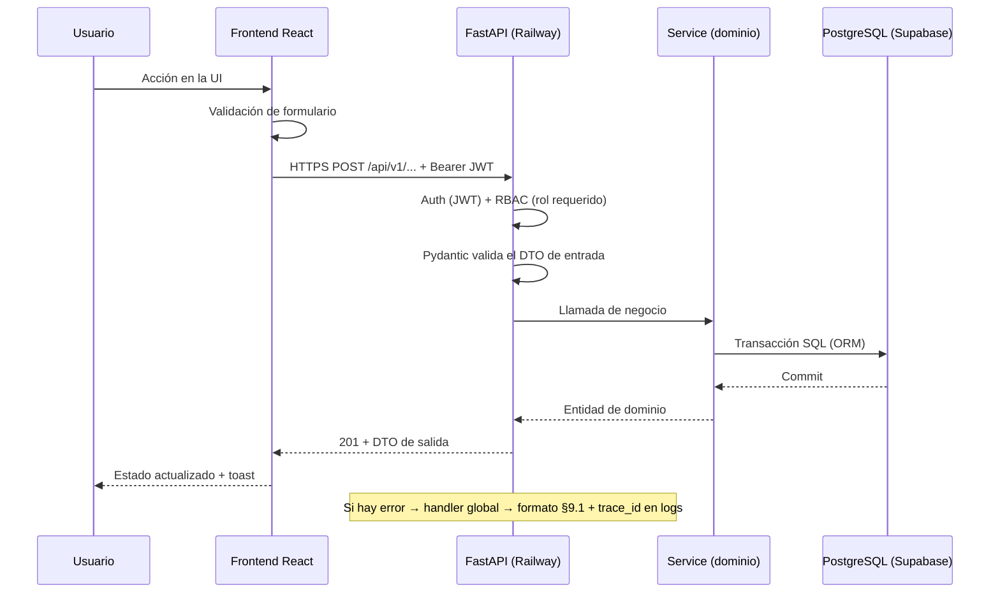
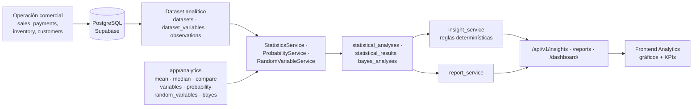
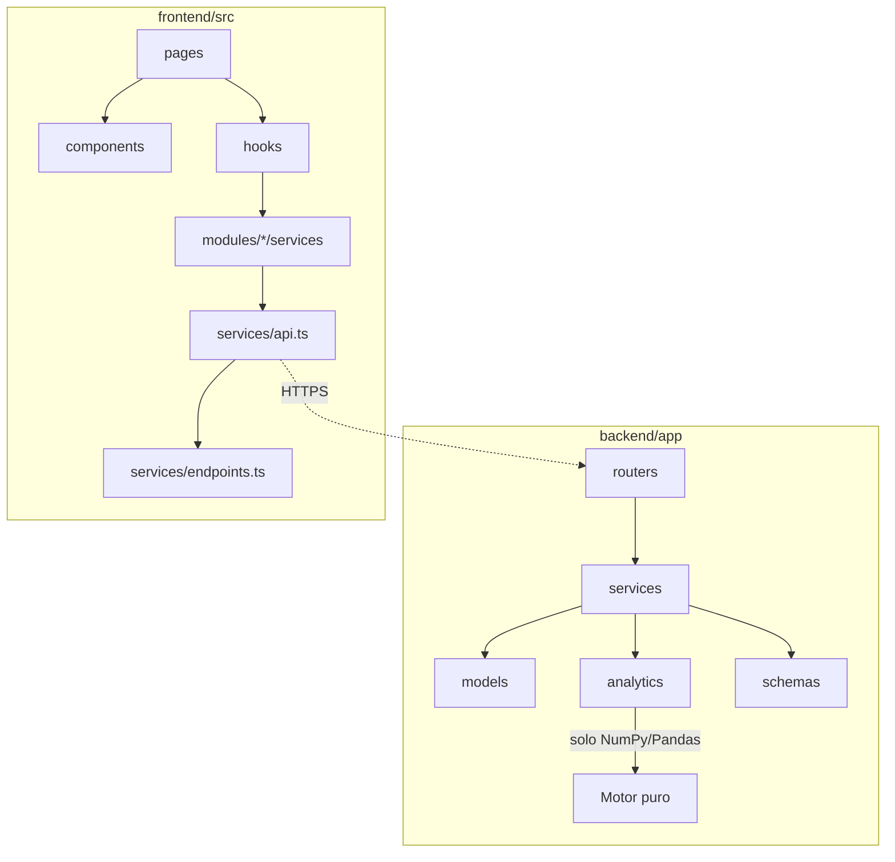
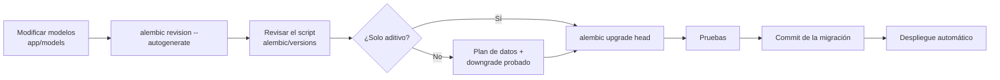

# 02 · Arquitectura Técnica

**SalesIA Enterprise** — Documento 02 de la serie de arquitectura · Versión 1.1 (fusión)

> **Entregable FASE 02 – Arquitectura técnica:** *"Arquitectura, módulos, estructura de carpetas,
> contratos API y decisiones tecnológicas."*
> Fuente normativa: *Plan Integral de Desarrollo v1.0* · Requisitos: [`01_requisitos.md`](01_requisitos.md)
> · Contrato REST: [`05_api.md`](05_api.md)
>
> **v1.1** = fusión del documento del equipo (v1.0) con el análisis detallado de la revisión de Fase 02.
> Ninguna aportación de la versión original fue descartada.

---

## 0. Cumplimiento de la FASE 02

| Requisito de la fase | Sección | Estado |
|---|---|---|
| Separar frontend React, API Python y PostgreSQL | §1, §3, §4 | ✅ |
| Definir módulos por dominio | §6, §7 | ✅ |
| Definir DTO/schemas y contratos REST | §8 + [`05_api.md`](05_api.md) | ✅ |
| Definir manejo de errores, autenticación y autorización | §9, §10 | ✅ |
| Definir estrategia de migraciones y ambientes | §11, §12 | ✅ |

---

## 1. Principios arquitectónicos

| # | Principio | Implicación |
|---|---|---|
| P-01 | **Las ventas generan los datos** | No hay módulo estadístico aislado: todo cálculo proviene de la operación comercial persistida en PostgreSQL. |
| P-02 | **Separación de capas** | Presentación (React), lógica de negocio (servicios), persistencia (modelos/BD). El frontend **nunca** accede directo a la BD (RNF-08). |
| P-03 | **Modularidad por dominio** | Cada dominio agrupa router → schema → service → model. Cambiar un dominio no rompe a los demás (RNF-01). |
| P-04 | **El servidor manda** | Totales, stock y cálculos estadísticos se resuelven siempre en el backend (RN-11, RN-23). |
| P-05 | **API primero** | [`05_api.md`](05_api.md) es la frontera oficial entre frontend y backend; versionada en `/api/v1`. |
| P-06 | **Configuración por entorno** | Ningún secreto en el código; todo por variables de entorno (RNF-10, RN-36). |
| P-07 | **Trazabilidad por defecto** | Escrituras críticas generan `audit_logs`; errores generan `trace_id` en logs. |
| P-08 | **Despliegue reproducible** | Un solo comando para levantar el entorno local completo. |

---

## 2. Visión general

### 2.1 Diagrama de despliegue

```
USUARIO
  │
  ▼
REACT + TYPESCRIPT          → Frontend (Vercel)
  │  HTTPS / REST
  ▼
FASTAPI                     → Backend (Railway)
  ├── Auth
  ├── Customers
  ├── Products
  ├── Sales
  ├── Inventory
  ├── Statistics
  ├── Probability
  ├── Insights
  └── Reports
  │
  ├──────────────► PYTHON / NUMPY / PANDAS / SCIPY
  │
  ▼
POSTGRESQL                  → Supabase (PostgreSQL gestionado)
  ├── Operación comercial
  ├── Datos analíticos
  ├── Resultados
  └── Auditoría
```

**Principio rector:** separación de presentación, lógica de negocio y persistencia (RNF-08).

### 2.2 Componentes y responsabilidades

| Componente | Tecnología | Responsabilidad | NO debe hacer |
|---|---|---|---|
| **Frontend** | React 18 + TypeScript + Vite + Tailwind (Vercel) | Presentación, validación inmediata, consumo de API, gráficos | Calcular totales, persistir datos, validar con autoridad |
| **API** | FastAPI + Pydantic + Uvicorn (Railway) | Contrato REST, validación, autorización, lógica de negocio, motor estadístico | Guardar secretos en código, servir HTML de negocio |
| **Motor estadístico** | NumPy / Pandas / SciPy (`app/analytics`) | Media, mediana, comparación, variables, probabilidad, Bayes | Acceder directo a la BD (lo hace vía servicios) |
| **Base de datos** | PostgreSQL 16 (Supabase) | Persistencia, integridad referencial, índices, auditoría | Contener lógica de negocio compleja |
| **Migraciones** | Alembic | Evolución versionada del esquema | Cambiar producción sin rollback probado |
| **Entorno local** | Docker Compose | `postgres` + `backend` + `frontend` en una máquina | Gestionar secretos dentro de imágenes |

### 2.3 Secuencia de una petición



### 2.4 Flujo del motor estadístico



---

## 3. Stack tecnológico y decisiones

| Capa | Tecnología | Justificación |
|---|---|---|
| Frontend | React + TypeScript + Vite + Tailwind CSS | Tipado estricto, build rápido, sistema de utilidades para UI consistente. |
| Backend | Python + FastAPI | Validación automática con Pydantic, OpenAPI documentada (RNF-05), async. |
| Motor estadístico | NumPy / Pandas / SciPy | Librerías estándar para cálculo estadístico y pruebas (base académica Semana 07). |
| Base de datos | **PostgreSQL (Supabase)** | Integridad referencial (RNF-03), SQL potente para consultas analíticas, pooler incluido. |
| ORM / Migraciones | SQLAlchemy 2.x + Alembic | Migraciones versionadas y reproducibles por ambiente. |
| Autenticación | JWT (Bearer) + bcrypt | Stateless, estándar REST, compatible con roles. |
| Pruebas | Pytest + HTTPX | Niveles unitario / API / integración. |
| Despliegue | **Vercel (frontend) · Railway (backend) · Supabase (DB)** | CI automático por rama y previews por Pull Request. |
| Entorno local | Docker Compose | Reproducibilidad sin depender de la nube (CA2-01). |

### 3.1 Decisiones clave

1. **API versionada** en `/api/v1` — permite evolucionar sin romper clientes.
2. **Contratos tipados en ambos lados** — schemas Pydantic (backend) y tipos TypeScript (frontend) espejan los mismos DTO.
3. **Errores centralizados** — un manejador único con formato estándar (RNF-11). *Ver DEC-00 en §9.1.*
4. **Migraciones, nunca edición directa de BD** — todo cambio de esquema pasa por Alembic y queda en el repo; aplica también a Supabase.
5. **Configuración solo por variables de entorno** — cero secretos en el código (RNF-10).
6. **JSON en `snake_case` sin transformación** — Pydantic y TypeScript comparten los mismos nombres de campo (AR-05).

---

## 4. Estructura del proyecto

### 4.1 Árbol del repositorio

```
SALESIA-ENTERPRISE/
├── frontend/                    # React + TypeScript (Vite)
│   └── src/
│       ├── app/                 # App, router, providers
│       ├── components/          # Kit de UI reutilizable
│       │   ├── ui/  tables/  feedback/  charts/
│       ├── layouts/             # Sidebar, topbar, layouts de página
│       ├── modules/             # Un módulo por dominio
│       │   ├── auth/  dashboard/  customers/  products/  sales/
│       │   ├── inventory/  analytics/  probability/  insights/  reports/
│       │   └── (cada uno: pages/ components/ services/)
│       ├── services/            # Cliente HTTP base (api.ts), endpoints.ts
│       ├── hooks/               # useAuth, useSales, useStatistics, useInsights
│       ├── types/               # Tipos TS (espejo de DTOs)
│       ├── styles/
│       └── utils/               # Validadores, formatters, constantes
│
├── backend/                     # Python + FastAPI
│   ├── alembic/                 # Migraciones (versions/) + env.py
│   ├── alembic.ini
│   ├── app/
│   │   ├── main.py              # Factory de la app
│   │   ├── api/v1/routers/      # Un router por dominio
│   │   ├── api/deps.py          # get_current_user, require_role
│   │   ├── core/                # config, database, security, logging, exceptions
│   │   ├── models/              # Modelos SQLAlchemy (22 entidades)
│   │   ├── schemas/             # DTOs Pydantic (request/response)
│   │   ├── services/            # Lógica de negocio transaccional
│   │   ├── analytics/           # Motor estadístico puro (media, mediana, Bayes…)
│   │   └── utils/               # helpers, validators
│   ├── tests/                   # unit/ · api/ · integration/
│   ├── requirements.txt
│   └── Dockerfile
│
├── database/                    # SQL de referencia y seeds  (se crea en FASE 04)
├── docs/                        # Esta serie de documentos
├── docker-compose.yml           # Entorno local unificado
├── .env.example                 # Variables requeridas (sin valores)
├── .env                         # Valores reales — NO versionado
└── .gitignore
```

### 4.2 Desviaciones plan ↔ repositorio y resolución

| ID | Desviación | Decisión | Estado |
|---|---|---|---|
| D-01 | El plan define `app/statistics/`, `app/probability/`, `app/reports/`; el repo usa `app/analytics/` | **AR-01:** se confirma `app/analytics/` como paquete único del motor estadístico. Reportes en `services/report_service.py`. Un solo responsable y pruebas unitarias en un solo lugar. | ✅ Cerrada |
| D-02 | El plan define `database/migrations/` y `database/seeds/`; el repo usa `backend/alembic/` sin `seeds/` | **AR-02 (revisada):** migraciones de esquema en `backend/alembic/versions/` (Alembic mantiene la versión de cada migración); **SQL de referencia y seeds en `database/`** en la raíz, tal como define el equipo. Ambos se crean en **FASE 04**. Nunca se edita el esquema a mano en Supabase. | ✅ Cerrada |
| D-03 | `frontend/src/components/` estaba vacío | **AR-03:** kit de UI compartido con 4 subcarpetas: `ui/`, `tables/`, `feedback/`, `charts/`. Los módulos solo importan de aquí, nunca entre sí. | ✅ Cerrada |
| D-04 | **RF-05 Gestión de vendedores sin implementación** (solo `models/employee.py`) | **AR-04:** stack completo `routers/employees.py` + `schemas/employee.py` + `services/employee_service.py` + módulo frontend `modules/employees/`. El contrato ya existe en [`05_api.md`](05_api.md) §2.5. | ⚠️ **Pendiente aprobación PO** |
| D-05 | Cadena de datos del plan | Sin desviación: los 22 modelos analíticos existen. | ✅ Sin desviación |

---

## 5. Módulos por dominio (backend)

### 5.1 Mapa dominio → archivos

| # | Dominio | Modelos | Router | Service | Schema | Frontend |
|---|---|---|---|---|---|---|
| D1 | **Identidad y acceso** | `user`, `role` | `auth.py` | `auth_service.py` | `auth` | `modules/auth` |
| D2 | **Maestros** | `customer` | `customers.py` | `customer_service.py` | `customer` | `modules/customers` |
| | | `product`, `category` | `products.py` | `product_service.py` | `product` | `modules/products` |
| | | `employee` | `employees.py` ⚠️ AR-04 | `employee_service.py` | `employee` | `modules/employees` ⚠️ |
| D3 | **Ventas y cobros** | `sale`, `sale_detail`, `payment` | `sales.py` | `sale_service.py` | `sale` | `modules/sales` |
| D4 | **Inventario** | `inventory`, `inventory_movement` | `inventory.py` | `inventory_service.py` | *(FASE 04)* | `modules/inventory` |
| D5 | **Analítica de datos** | `dataset`, `dataset_variable`, `observation` | `statistics.py` | `statistics_service.py` | `statistics` | `modules/analytics` |
| D6 | **Probabilidad** | `random_variable`, `bayes_analysis` | `probability.py`, `random_variables.py` | `probability_service.py`, `random_variable_service.py` | `probability` | `modules/probability` |
| D7 | **Inteligencia** | `insight` | `insights.py` | `insight_service.py` | `insight` | `modules/insights` |
| D8 | **Reportes** | `report` | `reports.py` | `report_service.py` | `report` | `modules/reports` |
| D9 | **Tablero** | *(vista agregada)* | `dashboard.py` | `statistics_service.py` | `statistics` | `modules/dashboard` |
| D10 | **Plataforma** | `company`, `audit_log` | `audit.py` *(FASE 13)* | *(core)* | — | — |

### 5.2 Responsabilidad de cada módulo backend

| Módulo | Responsabilidad |
|---|---|
| `auth` | Login, JWT, roles y permisos (RF-01, RF-02). |
| `customers` | CRUD clientes e historial (RF-03). |
| `products` | CRUD productos y categorías (RF-04). |
| `employees` | Vendedores y métricas comerciales (RF-05). |
| `sales` | Venta, detalle, pagos — transaccional (RF-06, RF-07). |
| `inventory` | Stock y movimientos (RF-08). |
| `dashboard` | Resumen ejecutivo de KPIs (RF-09). |
| `statistics` | Media, mediana, comparación, variables, datasets, historial (RF-10…RF-14, RF-21). |
| `probability` | Probabilidades y Teorema de Bayes (RF-16, RF-17). |
| `random_variables` | Análisis de variables aleatorias (RF-15). |
| `insights` | Reglas determinísticas y observaciones (RF-19). |
| `reports` | Generación y consulta de reportes (RF-20). |
| `audit` | Bitácora de acciones críticas (RF-22). |

### 5.3 Reglas de dependencia entre capas



| Regla | Detalle |
|---|---|
| RD-1 | `routers/` **no** contiene lógica de negocio: valida con schema, llama al `service` y devuelve DTO. |
| RD-2 | `services/` **no** conoce HTTP: recibe objetos Pydantic, opera `models/` dentro de sesión/transacción. |
| RD-3 | `analytics/` es **funcional puro**: funciones puras sobre `list[float]` o `DataFrame`; sin BD, sin HTTP, sin estado. |
| RD-4 | `models/` no expone JSON; la salida siempre pasa por `schemas/`. |
| RD-5 | Un servicio invoca a otro solo dentro de su dominio o hacia abajo (ventas → inventario). Nunca hacia arriba. |
| RD-6 | El frontend consume la API solo vía `modules/<dom>/services` → `services/api.ts`. Prohibido `fetch` disperso. |
| RD-7 | Un módulo frontend no importa componentes de otro módulo; comparte únicamente vía `src/components/`. |

---

## 6. Estructura frontend

| Módulo | Ruta | Páginas | Responsabilidad |
|---|---|---|---|
| `auth` | `/login` | `LoginPage` | Login, recuperación de clave |
| `dashboard` | `/` | `DashboardPage` | KPIs ejecutivos, filtros |
| `customers` | `/clientes` | `CustomersPage` | CRUD, ficha, historial |
| `products` | `/productos` | `ProductsPage` | CRUD, categorías, precios |
| `sales` | `/ventas` | `SalesPage` | Carrito, emisión, pagos, historial |
| `inventory` | `/inventario` | `InventoryPage` | Stock, movimientos, alertas |
| `analytics` | `/analytics` | `AnalyticsPage` | Media, mediana, comparación, variables, gráficos |
| `probability` | `/probabilidad` | `ProbabilityPage` | Probabilidades, VA, Bayes |
| `insights` | `/insights` | `InsightsPage` | Lista, detalle y evidencia numérica |
| `reports` | `/reportes` | `ReportsPage` | Generación, exportación, impresión |
| `employees` | `/vendedores` | `EmployeesPage` | ⚠️ AR-04 pendiente de aprobación |

**Estructura interna estándar:** `modules/<dominio>/{pages,components,services}`.

---

## 7. Contratos API (resumen)

- **Base:** `GET|POST|PUT|PATCH|DELETE /api/v1/<recurso>`
- **Formato:** JSON (UTF-8), fechas ISO 8601 en UTC, montos numéricos con 2 decimales.
- **Campos:** `snake_case` idéntico entre Pydantic y TypeScript (AR-05).
- **Autenticación:** `Authorization: Bearer <token>` salvo endpoints públicos (`/auth/login`, `/health`).
- **Listados:** `{ "items": [...], "total": n, "page": n, "page_size": n, "pages": n }`
- **Creación:** `201` + objeto creado (+ cabecera `Location`) · `204` en DELETE exitoso.
- **Errores:** formato de §9.1.
- **Códigos:** `200` · `201` · `204` · `400` · `401` · `403` · `404` · `409` · `422` · `429` · `500`.

**Detalle completo — 66 operaciones, DTO de ejemplo por dominio, mapa de autorización y trazabilidad RF → endpoint: [`05_api.md`](05_api.md).**

---

## 8. Autenticación y autorización

### 8.1 Autenticación (JWT)

1. `POST /api/v1/auth/login` → valida credenciales → devuelve `access_token` (JWT) + `refresh_token`.
2. El JWT incluye `sub` (user id), `role`, `company_id` y `exp`.
3. La dependencia `get_current_user` resuelve el usuario; `require_role(...)` restringe por rol.
4. Contraseñas con hash **bcrypt** (cost 12), jamás en texto plano (RN-30).
5. La auditoría registra: `user_id`, acción, entidad, fecha, `ip`, detalle (RN-34).

| Aspecto | Decisión |
|---|---|
| Algoritmo | HS256, firmado con `SECRET_KEY` |
| Access token | 30 min (`ACCESS_TOKEN_EXPIRE_MINUTES`) |
| Refresh token | Vigencia prolongada, rotación en cada uso |
| Transporte | Header `Authorization: Bearer <token>` |
| Bloqueo | 5 intentos fallidos → bloqueo 15 min y `429` (RN-31) |
| Aislamiento | `company_id` del token filtra **todas** las queries (multiempresa) |

### 8.2 Autorización (RBAC)

**Matriz de acceso por módulo:**

| Módulo | Admin | Gerente | Vendedor | Analista | Almacén |
|---|:-:|:-:|:-:|:-:|:-:|
| Usuarios / configuración | ✅ | ❌ | ❌ | ❌ | ❌ |
| Clientes | ✅ | 👁️ | ✅ | 👁️ | ❌ |
| Productos | ✅ | 👁️ | 👁️ | ❌ | 👁️ |
| Vendedores | ✅ | 👁️ | ❌ | 👁️ | ❌ |
| Ventas / pagos | ✅ | 👁️ | ✅ | 👁️ | ❌ |
| Inventario | ✅ | 👁️ | ❌ | ❌ | ✅ |
| Dashboard / Analytics | ✅ | ✅ | ❌ | ✅ | 👁️ |
| Reportes / insights | ✅ | ✅ | 👁️ | ✅ | ❌ |
| Auditoría | ✅ | ❌ | ❌ | ❌ | ❌ |

✅ acceso total · 👁️ solo lectura · ❌ sin acceso

> Matriz detallada por acción (C/R/U/D) en [`01_requisitos.md`](01_requisitos.md) §4.1.
> La autoridad **siempre** está en el backend: el frontend solo oculta la interfaz.

```python
# Ejemplo de uso en un router
@router.post("/sales", response_model=SaleResponse, status_code=201)
def create_sale(
    payload: SaleCreate,
    user: User = Depends(require_role("Administrador", "Gerente", "Vendedor")),
    svc: SaleService = Depends(get_sale_service),
):
    return svc.create(payload, actor=user)
```

### 8.3 Seguridad transversal

| Control | Medida |
|---|---|
| Secretos | Solo variables de entorno; `.env` está en `.gitignore` y verificado antes de cada commit (RN-36). |
| HTTPS | Obligatorio en Vercel y Railway (FASE 15). |
| CORS | Lista explícita: dominio de Vercel producción + previews. |
| Rate limit | Login limitado a 5 intentos/min por IP. |
| Validación | Pydantic en entrada; `nullable=False` y FK en la BD (RNF-02/RNF-03). |
| Supabase | La **service_role** key nunca viaja al frontend; solo se usa en backend. El navegador solo conoce la **anon** key. |
| Exposición | Errores sin stack trace; logs sin contraseñas ni tokens. |

---

## 9. Manejo de errores

### 9.1 Formato estándar

```json
{
  "code": "BUSINESS_RULE_ERROR",
  "message": "El stock disponible es insuficiente.",
  "detail": [
    { "field": "items[0].quantity", "issue": "Disponible: 3, solicitado: 5" }
  ]
}
```

> ⚠️ **DEC-00 — PENDIENTE DE DECISIÓN.** El criterio **CA-48 de `01_requisitos.md` (FASE 01 aprobada)**
> define `{ codigo, mensaje, detalle }` (claves en español). El equipo define `{ code, message, detail }`
> (claves en inglés) y ambos incluyen trazabilidad. **Decisión diferida por el Product Owner**; mientras
> tanto, ambos formatos son válidos y el backend implementará un único adaptador para no duplicar código.

### 9.2 Mecanismo

1. **Excepciones de dominio** en `core/exceptions.py`: `NotFound`, `Forbidden`, `Conflict`, `BusinessRuleError`, `ValidationError`, `AuthError`.
2. **Middleware global** captura excepciones no manejadas y las traduce al formato estándar (RNF-11).
3. En producción la respuesta **nunca** expone stack traces; el detalle queda en logs con `trace_id` (RNF-07).
4. `RequestValidationError` de Pydantic → `422` traducido al formato estándar, campo a campo.
5. El frontend distingue: error de red (reintento), `401` (refrescar sesión), `403` (mensaje de permiso), `422/400` (validación campo a campo).

### 9.3 Catálogo de códigos de negocio

| code | HTTP | Caso |
|---|---|---|
| `VALIDATION_ERROR` | 422 | Falla de schema/Pydantic |
| `UNAUTHENTICATED` | 401 | Token ausente o expirado (RN-32) |
| `FORBIDDEN` | 403 | Rol sin permiso |
| `NOT_FOUND` | 404 | Recurso inexistente |
| `CONFLICT` | 409 | Duplicado (SKU, email, documento) — RN-01, RN-03 |
| `BUSINESS_RULE_ERROR` | 400 | Regla de negocio (stock, totales, estados) — RN-10, RN-16, RN-19, RN-20 |
| `RATE_LIMITED` | 429 | 5 intentos fallidos de login (RN-31) |
| `BAYES_POR_CERO` | 422 | `P(B) = 0` en el Teorema de Bayes (RN-43) |
| `DATOS_INSUFICIENTES` | 400 | Menos de 2 observaciones (RN-40) |
| `INTERNAL_ERROR` | 500 | No controlado (`trace_id` en logs) |

---

## 10. Estrategia de migraciones



| Regla | Detalle |
|---|---|
| M-01 | Nombre: `NNN_descripcion.py` (ej. `0001_esquema_inicial`). |
| M-02 | Cada migración es **inmutable** una vez mergeada; los cambios se hacen con una nueva. |
| M-03 | Toda migración destructiva requiere `downgrade()` funcional y prueba de rollback. |
| M-04 | Índices y constraints se crean **en la migración**, no solo en el modelo. |
| M-05 | La migración inicial crea las **22 tablas** de `04_modelo_er.md`. |
| M-06 | Los seeds (`database/seeds/`) son **idempotentes**: roles, categorías, usuario admin, productos de demo. Nunca van dentro de `upgrade()`. |
| M-07 | **Nunca editar datos ni esquema manualmente en el panel de Supabase.** |
| M-08 | `dev` y `test` corren migraciones automáticamente; `producción` las corre como paso explícito del despliegue, con respaldo previo. |

### 10.1 Ambientes

| Ambiente | Rama | Backend | Frontend | Base de datos |
|---|---|---|---|---|
| **local** | cualquier | `uvicorn` local | `npm run dev` | Postgres local (docker-compose) o Supabase (dev) |
| **preview** | Pull Request | build Railway | Preview Vercel | BD de desarrollo (Supabase) |
| **producción** | `main` | Railway | Vercel | **Supabase (producción)** |

Reglas:
- `ENVIRONMENT` ∈ `development` / `testing` / `production`.
- `DEBUG=true` está prohibido en `production` (el validador de `config.py` lo rechaza al arrancar).
- Ningún ambiente comparte la misma base de datos.

---

## 11. Variables de entorno

Definidas en [`.env.example`](../.env.example):

| Variable | Uso | Dónde se define |
|---|---|---|
| `ENVIRONMENT` | `development` / `testing` / `production` | ambas |
| `DATABASE_URL` | Conexión PostgreSQL (usar el **pooler** en producción) | Railway (backend) |
| `SECRET_KEY` | Firma JWT (`openssl rand -hex 32`) | Railway (backend) |
| `ACCESS_TOKEN_EXPIRE_MINUTES` | Vigencia del access token | Railway (backend) |
| `CORS_ORIGINS` | Orígenes permitidos (Vercel) | Railway (backend) |
| `API_BASE_URL` | URL pública de la API | Vercel (frontend) |
| `VITE_API_BASE_URL` | URL de la API para el cliente HTTP (solo con prefijo `VITE_`) | Vercel (frontend) |
| `SUPABASE_URL` | Proyecto Supabase | Railway (backend) |
| `SUPABASE_ANON_KEY` | Clave pública (segura para el navegador) | Railway / Vercel |
| `SUPABASE_SERVICE_ROLE_KEY` | Clave privilegiada — **solo backend, jamás en el frontend** | Railway (backend) |

> **RN-36 / RNF-10:** `.env` está en `.gitignore`. Solo se versiona `.env.example` con placeholders.

---

## 12. Despliegue

```
PRODUCCIÓN

React / Vite  ──►  Vercel  ──HTTPS──►  FastAPI (Railway)  ──►  PostgreSQL (Supabase)
```

- **Un servicio por paso:** primero DB (Supabase), luego backend con `/health`, luego frontend, luego integración.
- Cada Pull Request genera una **preview** (Vercel) sin afectar producción.
- CORS se configura con los orígenes exactos de Vercel (producción + previews).
- Health checks: `GET /health` permite verificar el deploy de forma automática.
- Logs y monitoreo desde el panel de Railway; errores de aplicación con `trace_id`.

### 12.1 Entorno local (Docker Compose)

| Servicio | Imagen | Puerto | Notas |
|---|---|---|---|
| `db` | `postgres:16-alpine` | 5432 (interno) | Volumen nombrado + healthcheck. *Alternativa:* apuntar a Supabase con `DATABASE_URL`. |
| `backend` | `backend/Dockerfile` | 8000 | Espera healthcheck de `db`, ejecuta `alembic upgrade head` al iniciar |
| `frontend` | build de Vite | 5173 (dev) | `VITE_API_BASE_URL` inyectada en build |

---

## 13. Supabase

### 13.1 Parámetros del proyecto

| Parámetro | Valor / ubicación |
|---|---|
| Proyecto | `ijgukrdqooebycnedisu` (ref extraído del JWT) |
| Región | `aws-0-us-east-2` |
| Conexión (pooler) | `aws-0-us-east-2.pooler.supabase.com:5432` |
| Usuario | `postgres.ijgukrdqooebycnedisu` |
| Base | `postgres` |
| Credenciales | **Solo en `.env`** — nunca en el repositorio ni en los documentos |

### 13.2 Tipos de clave

| Clave | Uso | ¿Puede ir en el frontend? |
|---|---|---|
| `anon` / publishable | Lectura pública según RLS | ✅ Sí |
| `service_role` / secret | Operaciones privilegiadas del backend, migraciones y seeds | ❌ **Nunca** |
| Legacy JWT secret | Firma de los tokens de Supabase (rotación) | ❌ Nunca |

### 13.3 Reglas de uso

1. **Conexión desde FastAPI:** usar el **Direct/Session pooler** con `DATABASE_URL` y `sslmode=require`.
2. **Producción:** siempre el *pooler* (no la conexión directa) para soportar conexiones serverless de Railway.
3. **RLS (Row Level Security):** activo en todas las tablas; la API accede con `service_role` desde el backend.
4. **Nunca** exponer `service_role` ni el JWT secret en variables con prefijo `VITE_`.
5. **Migraciones:** solo vía Alembic (`alembic upgrade head`), nunca desde el editor SQL del panel (M-07).
6. **Backups:** PITR de Supabase habilitado; restauración probada antes de la FASE 15 (CA-37 de Fase 01).
7. `.env` real **no se versiona**; se configura aparte en Railway y Vercel.

---

## 14. Estrategia de pruebas (RNF-09)

| Nivel | Ejemplos | Ubicación | Cobertura objetivo |
|---|---|---|---|
| Unitarias | Media, mediana, Bayes, validadores | `backend/tests/unit/` | ≥ 80% del motor |
| API | Status codes, schemas, permisos | `backend/tests/api/` | 100% de endpoints críticos |
| Integración | Venta → inventario → persistencia | `backend/tests/integration/` | Flujos transaccionales |
| Frontend | Formularios, rutas, filtros, estados | manuales / E2E (FASE 14) | — |
| Datos | Constraints, duplicados, valores nulos | SQL de verificación (FASE 04) | — |
| Aceptación | Flujo completo de venta y análisis | FASE 14 · `01_requisitos.md` §10 | 12 criterios maestros |

**Reglas:** datos de prueba aislados por corrida; sin red externa; los cálculos se validan contra los
valores esperados de la Semana 07 (CA-20 a CA-27 de `01_requisitos.md`).

---

## 15. Registro de decisiones

| ID | Decisión | Sección | Estado |
|---|---|---|---|
| AR-01 | Motor estadístico unificado en `app/analytics/` | §4.2 | ✅ Cerrada |
| AR-02 | Migraciones en `backend/alembic/versions/` + SQL y seeds en `database/` (raíz) | §4.2, §10 | ✅ Cerrada (revisada con el equipo) |
| AR-03 | Kit de UI en `src/components/{ui,tables,feedback,charts}` | §4.2 | ✅ Cerrada |
| AR-04 | Nuevo módulo `employees` para RF-05 | §4.2, §6 | ⚠️ **Pendiente aprobación PO** |
| AR-05 | JSON en `snake_case` idéntico en Pydantic y TypeScript | §3.1 | ✅ Cerrada |
| AR-06 | Despliegue: Vercel + Railway + **Supabase**; Docker Compose solo para entorno local | §2.1, §12 | ✅ Cerrada (confirmada por el equipo) |
| DEC-00 | Formato de error: `{ codigo, mensaje, detalle }` vs `{ code, message, detail }` | §9.1 | ⏸️ **Diferida por el Product Owner** |

---

## 16. Criterios de aceptación de la FASE 02

| ID | Criterio | Verificación |
|---|---|---|
| CA2-01 | Frontend, API y PostgreSQL están separados: Vercel → Railway → Supabase, y `docker compose` para local | §2.1, §12 |
| CA2-02 | Cada dominio tiene router, schema, service y model sin cruces prohibidos (RD-1…RD-7) | §5 |
| CA2-03 | El contrato REST cubre los 14 endpoints del plan y los necesarios para RF-01…RF-22 | `05_api.md` |
| CA2-04 | Existe un único formato de error documentado con su catálogo de códigos | §9 |
| CA2-05 | Toda petición protegida declara los roles requeridos | `05_api.md` §6 |
| CA2-06 | Existen los 3 ambientes (local/preview/producción) con sus variables de entorno | §10.1, §11 |
| CA2-07 | La estrategia de migraciones cubre autogeneración, revisión, rollback y semillas | §10 |
| CA2-08 | Las decisiones AR y DEC están registradas con responsable y estado | §15 |
| CA2-09 | Toda desviación de la FASE 01 tiene decisión formal cerrada o pendiente explícita | §4.2 |
| CA2-10 | Las credenciales de Supabase están solo en `.env`, verificado con `git check-ignore` | §13 |
| CA2-11 | El documento referencia al plan v1.0 y a `01_requisitos.md` | Cabecera |

---

## 17. Riesgos técnicos

| ID | Riesgo | Prob. | Impacto | Mitigación |
|---|---|---|---|---|
| RT-01 | El contrato API cambia tras implementar frontend/backend | Media | Alto | Contrato versionado en git; cambios solo con nueva versión `/v2` |
| RT-02 | Migración destructiva en producción | Baja | Crítico | M-03 (rollback obligatorio) + respaldo Supabase previo |
| RT-03 | Motor estadístico acoplado a BD y difícil de testear | Media | Alto | RD-3: `analytics/` puro y sin I/O |
| RT-04 | Fuga de `SECRET_KEY` o `service_role` key | Media | Crítico | Solo variables de entorno, prefijo `VITE_` prohibido para secretos, rotación |
| RT-05 | Consultas analíticas lentas sobre datos grandes | Media | Medio | Índices en FASE 04 + CA-41 (≤ 3 s / 100k registros) |
| RT-06 | RF-05 (vendedores) queda sin implementar por falta de aprobación | Alta | Medio | AR-04 con responsable y fecha en §15 |
| RT-07 | Dos versiones del mismo documento en la historia de git | Media | Medio | Fusión v1.1 documentada en este commit; historia preservada |

---

## 18. Evolución (Semana 08 en adelante)

La arquitectura permite incorporar sin reescritura: **varianza y desviación estándar**, distribuciones y
probabilidades, **pruebas de hipótesis**, **p-valor**, **esperanza matemática** y, si el alcance académico lo
permite, modelos predictivos. No requiere cambios de esquema ni de contrato, solo nuevos endpoints y
funciones en `app/analytics/`.

---

## 19. Entregables y siguiente fase

**Entregables FASE 02:**
1. Este documento (`docs/02_arquitectura.md`).
2. Contrato de API (`docs/05_api.md`).
3. Decisiones AR-01…AR-06 y DEC-00 registradas (§15).

**Condiciones de salida:** §16 completa (11/11) y aprobación del Product Owner.

**Siguiente:** **FASE 03 — UX/UI empresarial** → `docs/03_ux_ui.md`.

---

*SalesIA Enterprise — Arquitectura Técnica v1.1 (fusión) · FASE 02 · Grupo 4 — SENATI*
